```{r setup, include=FALSE}
knitr::opts_chunk$set(echo = FALSE)
```

# 1. Introduction

This post will be looking at the following data visualisations to identify possible areas of improvement. The data visualisations were created by a research scientist of a research team conducting study to understand the willingness of the public to take COVID-19 vaccinations.


We will also come up with a proposed design and implement it in tableau. Next, a step-by-step guide will be provided for coming up with the proposed design. Finally, we will list down major observations that we are able to derive from the proposed design.

# 2. Task

The tasks can be summarised as follows:

1.  Critic the existing visualisation
2.  Sketch a proposed design
3.  Implement the proposed design
4.  Provide steps for replication of the proposed design
5.  Major observations derived from the proposed design

## 2.1 Critic

> a.  Critic the graph from both its clarity and aesthetics. At least three from each evaluation criterion.

In terms of **clarity**, the following areas could be improved:

1.  There is no lead in paragraph for the visualisations, making in hard to determine what message is being conveyed to the viewer.

2.  The title of the left visualisation is supposedly about whether a country is pro-vaccine. However, it only utilises the response for the question "If a Covid-19 vaccine were made available to me this week, I would definitely get it." to draw the conclusion. However, there could be other factors which contribute to how people would respond to the question e.g. the prevalence of COVID-19 in a country, the attitude of the people to COVID-19, the standard of healthcare in a country.

3.  Both the visualisations represent the results as a percentage of the total records for each country. However, the viewer is not able to tell how many total results there are and may not know how representative the results is of the country. For example, a graph of only 10 results will not be as good a representation of a population compared to a graph of 1000 results.

4.  The two visualisations are not sorted consistently. The left visualisation is sorted by alphabetical order in terms of country, while the right one is sorted by the % of respondents who strongly agreed. This may be confusing to the viewer who may assume that both are sorted in the same way.

5.  The left visualisation uses 100% stacked bars, but this may be difficult to compare results of different countries

6.  The right visualisation only shows the proportion of users who strongly agreed. However, it may make more sense to show both those who scored 1 (strongly agree) and those who scored 2 if we want to convey the message of people who agree.

7.  The source of the data was not provided and therefore the viewer may not know where the data was sourced from.

In terms of **aesthetics**, the following areas could be improved:

1.  The left visualisation uses a five-colour scheme to colour the different values. However, there is no meaning to the colour scheme, and it would be better to use opposing colours for those that agree and those that disagree.

2.  There is a typo error in the first visualisation, where pro-vaccine is wrongly spelled as "pro-vacinne".

3.  The viewer will not know what the legend title refers to as it is indicated as "Vac1".

4.  The formatting of the tick values in the x-axis is not consistent across both visualisations.

## 2.2 Sketch of Proposed Design

> b.  With reference to the critics above, suggest alternative graphical presentation to improve the current design. The proposed alternative data visualisation must be in **static** form. Sketch out the proposed design. Support your design by describing the advantages or which part of the issue(s) your alternative design try to overcome.

The following is a sketch of the proposed design:


The proposed design comprises various controls on the top and two visualisations.

The controls will allow the viewer to select the following:

-   Survey Question

-   Show Measures - Actual Mean, 95% and 99% error bars

-   Breakdown By - To further breakdown the results by Age, Gender, Household Size, or Household Children

-   Sort By - To sort alphabetically by Country name or the Value

-   Sort Order - To sort in an ascending or descending manner

The top visualisation shows the proportion of survey respondents who agree with the survey question. It further includes the 95% and 99% error bars.

The bottom visualisation further breakdowns the survey results by various metrics.

The proposed design improves on the original design on the following areas:

-   The controls allow the viewer to choose the survey question and the respective results. This lets the viewer know how people responded, rather than using only a single question to deem how pro-vaccine a country is.

-   The inclusion of error bars provides a better visualisation of the uncertainty around the results. For example, certain countries may have less results and thus there is more uncertainty in the results. Without showing this uncertainty, the viewer may assume that the results are representative of the population of the countries.

-   The second visualisation lets viewers drilldown into the results by more metrics. This allow further analysis of the data to see if there is difference when broken down. For example, we are able to tell how males and females responded.

-   The controls allow the viewer to sort the results in a meaningful way. Sorting by country allows consistent placement to compare across various survey questions, while sorting by value allows comparison on how the different countries responded to the surveys.

## 2.3 Proposed Data Visualisation

> c.  Using Tableau, design the proposed data visualisation.


The proposed data visualisation has been uploaded to Tableau Public and can be found [here](https://public.tableau.com/views/COVID-19VaccineSurveyResults/VaccineSurveyDashboard?:language=en&:display_count=y&publish=yes&:origin=viz_share_link).

## 2.4 Step-by-step Description

> d.  Provide step-by-step description on how the data visualisation was prepared.

The following sections describe how the data visualisation was prepared.

### 2.4.1 Data preparation

The data used for the visualisations were gotten from the [Imperial College London YouGov Covid 19 Behaviour Tracker Data Hub](https://github.com/YouGov-Data/covid-19-tracker). There was one data file for each country, and the data files had different times when they were last updated ranging from 5 months ago to few days ago. Only countries with data that was updated recently, i.e. in the last 2 weeks, were used for our visualisation. Israel was excluded as it was only added in February 2021. The final data included the following countries - Australia, Canada, Denmark, France, Germany, Italy, Japan, Netherlands, Norway, Singapore, South Korea, Spain, Sweden and the United Kingdom.

Tableau Prep Builder (TPB) was used to prepare our data file. First, all the files were put into the same folder. Next, one of the files was loaded into TPB. The multiple files option in TPB was used to load all the files together as a wildcard union:


Each data file contained around 400 columns of data and each row of data was comprised survey responses and survey respondent demographics. Only data with vaccine related questions (e.g. vac_1, vac2_1, vac3) as well as survey respondents' demographics (e.g. gender, age) were retained. We excluded the other columns of data that were not used. The following columns were retained:


Next, a "clean" step was added. For cleaning, we first filter responses which were in 2021:


Next, we renamed the file paths column as "Country". We also renamed all the values e.g. australia.csv, singapore.csv to their proper country names e.g. Australia, Singapore:


Finally, the prepared data was saved for further use in Tableau:


### 2.4.2 Load Data

The prepared data was loaded in Tableau. Next, we created groups for the Age, Household Children, and Household Size columns. This allowed us to present the data in an aggregated manner.


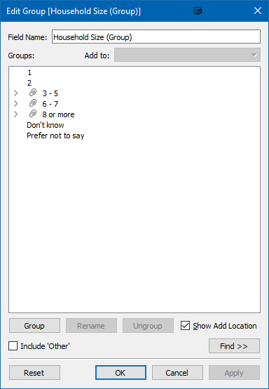

### 2.4.3 Creating Parameters

A new sheet is created for the first visualisation. In order to allow interactivity for the visualisations, we create a few parameters.

We first create a parameter to let the viewer choose the survey question. This parameter will be used to control which survey question the visualisation will show the results for.

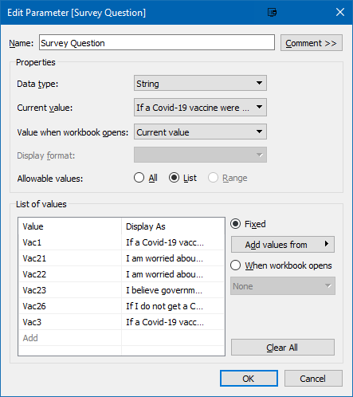

We created a corresponding calculated field to select the appropriate column based on the choice of survey question.

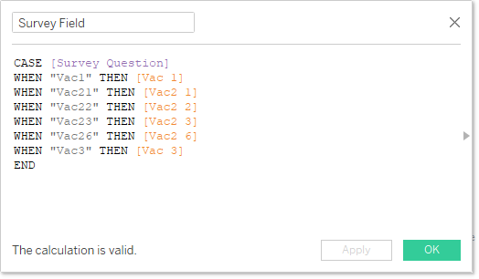

Next, we create a parameter called "Show". This will allow the viewer to select which elements to show, i.e. whether to show the Actual Mean, the 95% error bar, and/or the 99% error bar.


We create a parameter called "Breakdown By" to allow the viewer to breakdown the results by various metrics.


We create a corresponding calculated field to select the appropriate column based on the viewer's selection.


Lastly, we create two more parameters to allow the viewer to control the sorting.


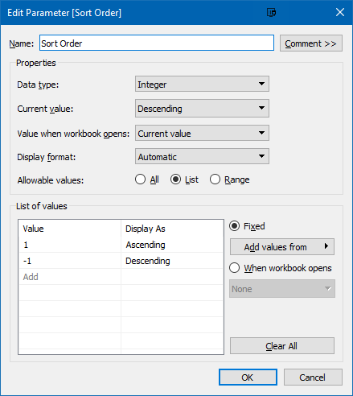

Finally, we right click on all the parameters and select "Show Parameter" to show them on the worksheet.

### 2.4.4 Creating Fields for Visualisation

Next, we create the various fields that will support the visualisation.

We create a field called "Total Respondents". This field will sum up the total number of respondents, excluding the aggregation at the "Country" level. This field will mainly be used for the title to show the total number of respondents.

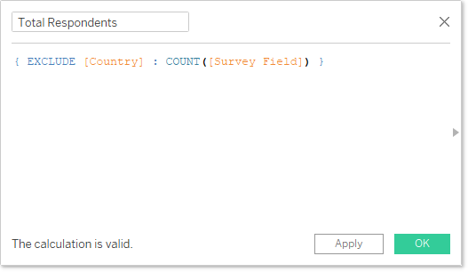

Next, we create a field for the percentage of respondents who agree. This is computed by summing the people who responded with "1 - Strongly agree" or "2" and dividing it by the number of respondents.


Next, we create a field for the total mean, without aggregation at the "Country" level. Similar to total respondents, this will be used for the title as well as the reference line.

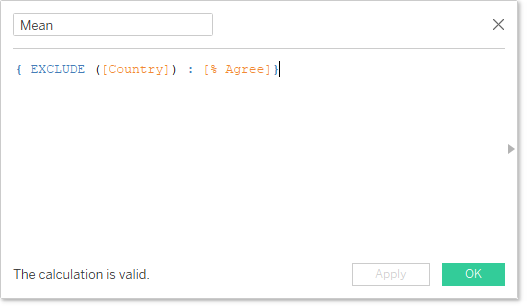

Next, we create two constant fields for the 95% and 99% z values. These will be used to compute the 95% and 99% error bars.


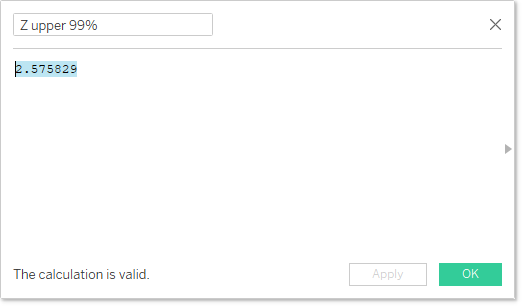

Next, we create a field for "Standard Error". Standard error is computed using the following formula:

$$\sqrt{\frac{percentage * (1-percentage)}{sample size}}$$

This is translated to the following calculated field:

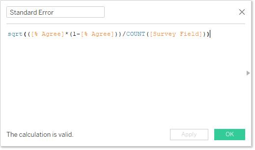

Next, we create the fields to get the margin of error for 95% and 99%:

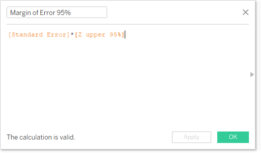

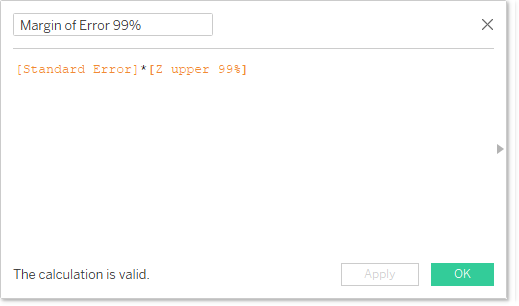

Next, we created four fields for the upper and lower values of 95% and 99%.

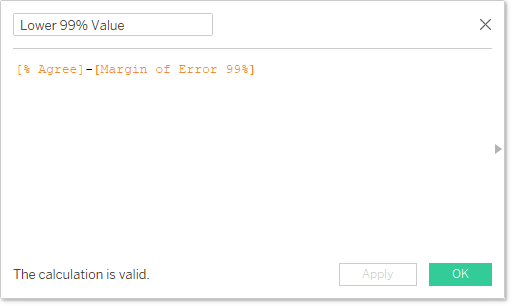


Next, we create the fields that will be used to display the elements on the visualisation. The "Show" parameter created earlier is used to control which elements to show. By checking if the parameter contains the various values, we show the relevant elements as appropriate.

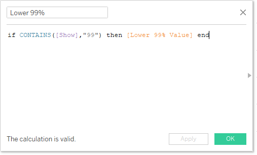


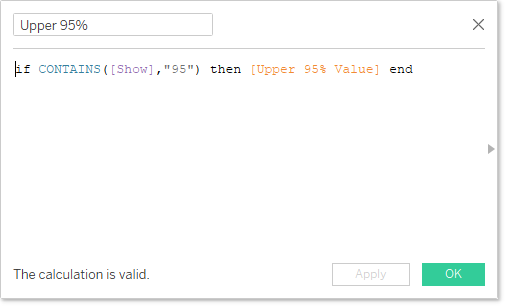

Finally, we create "Sort Field" to control how we sort the elements on the graph.

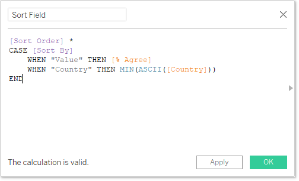

### 2.4.5 Creating Survey Results Visualisation

We first add the "% Agree" field to the Columns shelf and the "Country" field to the Rows shelf.

We change the mark to circle to display the % who agree as a circle on the visualisation.

We adjust the x-axis to be fixed from 0 to 1, with tick marks at intervals of 0.1. We also change the format for the x-axis to be in percentage with no decimal places.

We drag "Measure Values" to the Columns shelf. We remove the irrelevant measures from the "Measure Values" shelf, leaving only the Upper/Lower 95%/99% values.


We change the axes to dual axis and synchronise the axes. We change the second axis to use "line" and drag "Measure Names" to the "Path" icon.

We click the detail icon to change it to colour, to colour the different error bars. We change the colours in the legend to light gray for 99% and dark gray for 95%. We also change the previous mark for "% Agree" to blue.

Since we are using calculated fields to show or hide the error bars, we want to hide the indicator that shows that there are null values. We do this by going to "Analysis \> Special Values \> Hide".

We also hide the top axis since both axes are synchronised. We do this by right-clicking on it and unticking "Show Header".

To show the percentage next to the name of the countries, we drag "% Agree" to the Rows shelf to the right of "Country". We change it from a continuous measure to a discrete measure. We also change the number format for "% Agree," and the other 95% and 99% values to a percentage with 0 decimal places.

To implement our custom sort using our two parameters, we sort "Country" in the row shelf using the following settings:


We add another element to show the Grand Total by going to "Analysis \> Totals \> Show Column Totals" and also "Column Totals to Top". This will show us the result for all survey respondents.

Next, we drag the "Mean" and "Total Respondents" fields to the detail icon of the "AGG(% Agree)" mark. This will allow us to use them for the title of the visualisation and the reference line. We add a reference line to show the overall mean:


We add a meaningful title to the visualisation:

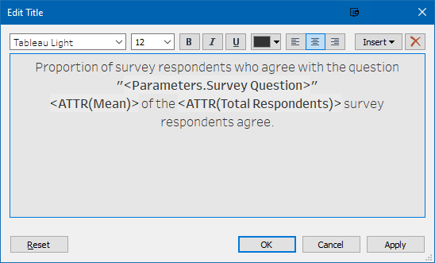

We create a new calculated field "Number of Respondents" to allow us to show the number of respondents for the survey. This field will take a constant value of 1, but will allow us to sum it to get the number of respondents. This field is similar added to the detail icon.

We add meaningful tooltips for the mean and error bars:

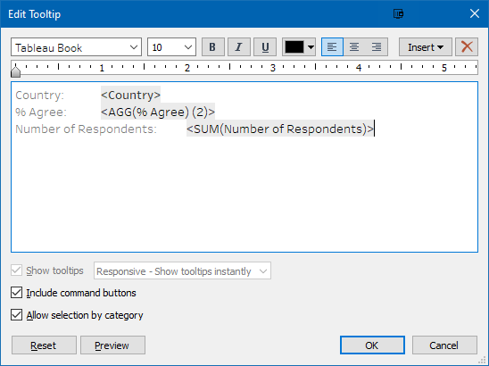

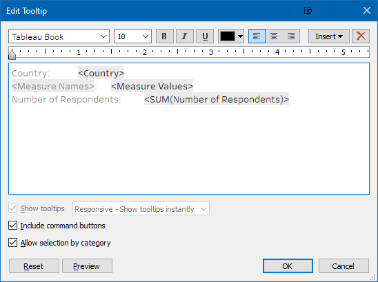

We add animation to the analysis to allow the viewer to visualise the changes better.

The final visualisation for the survey results is as follows:

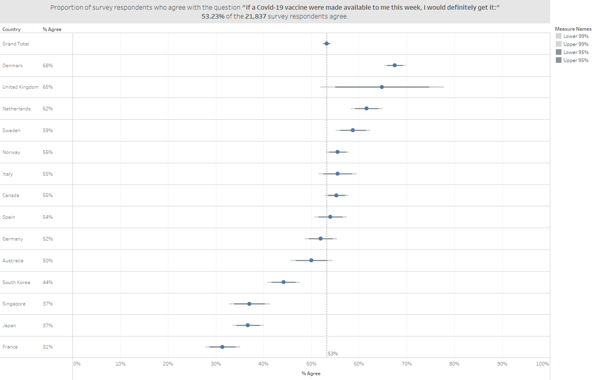

### 2.4.6 Creating Visualisation for further breakdown of results

In order to create another visualisation to breakdown the results, we duplicate the previous worksheet to minimise the number of steps required. We rename the duplicated sheet as "Breakdown of Results".

Since we want to breakdown by another field instead of country, we replace "Country" in the rows shelf with "Breakdown Field".

We change the reference line to use the total of "% Agree".


Since we no longer need the total respondents for this visualisation, we remove it from the detail. Instead, we add the "Breakdown By" field.

We change the tooltips to dynamically display the breakdown field label:


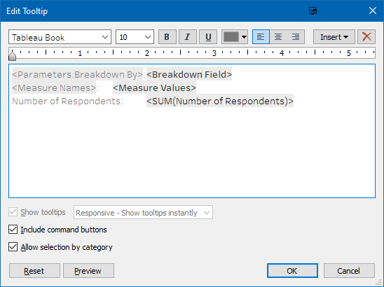

The final visualisation for the breakdown is as follows:

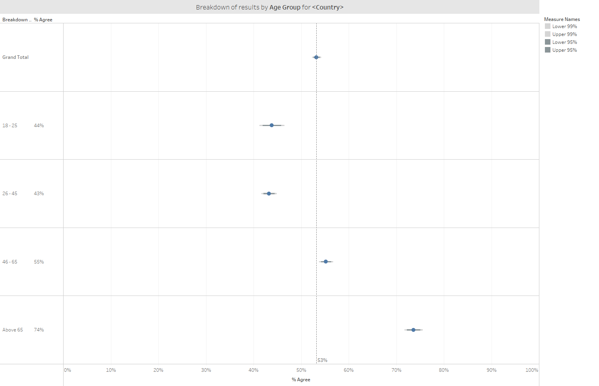

### 2.4.7 Combining it together into a Dashboard

Finally, we create a Dashboard to combine both visualisation. The following steps were done to create the worksheet:

1.  Drag both worksheets into the dashboard area.

2.  We add texts the top and bottom of the dashboard for the title and source used for the charts. We add the parameter controls to the top of the chart.

3.  We resize the areas for the various visualisation for aesthetic purposes.

4.  We add an action to allow interactivity between the two visualisations. Selecting a country on the top visualisation will show the breakdown for that country only in the bottom visualisation.

    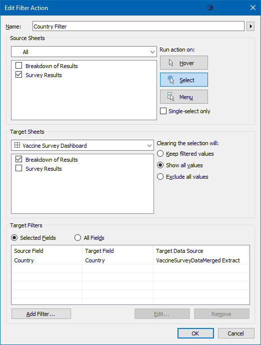

The final product of the proposed visualisation in the form of a dashboard is as follows:


## 2.5 Major Observations

> e.  Describe three major observations revealed by the data visualisation prepared.

Using the proposed data visualisations, we can observe the following:

1.  More people would like to adopt a "wait and see" approach for getting the vaccine. Comparing the responses for the question on whether they are willing to take the vaccine this week against whether they are willing to take the vaccine a year from now, the percentage of people who agree increased for all countries except for Germany:

    

    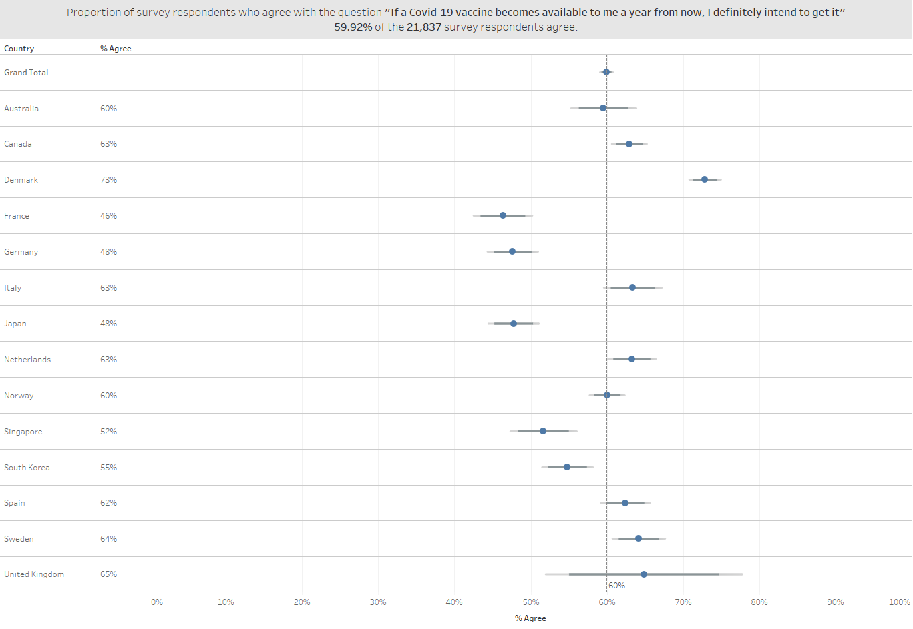

2.  Older people were generally more willing to take the vaccine as compared to younger people. This could be due to the fact that they are less worried about potential side effects of the vaccine as compared to younger people.

3.  Females were more worried about the potential side effects of a COVID-19 compared to males. This can be seen from the results where the proportion of females in all countries exceeded the proportion of males who agreed that they were worried about the potential side effects.

4.  The residents of Japan have less believe in their Government to provide them with an effective vaccine. This can be seen by the fact that only **47%** (2nd lowest among all countries) believe that their Government will provide them with an effective vaccine, but only **37%** (2nd lowest among all countries) of them willing to take a vaccine this week and **68%** (highest among all countries) of them worried about getting COVID-19. This has also been observed in the following article [**Survey: Japanese less trusting of government in health crisis**](http://www.asahi.com/ajw/articles/13370715), which shows that the Japanese are less trusting of government in a health crisis.

# 3. Conclusion

In this post, we look at how to present vaccine survey data for various countries. We identify areas of improvement in terms of clarity and aesthetics for the chart and propose changes to improve the visualisation. We further added interactive elements to enhance viewers' experience to analyse the data. We implemented the changes in Tableau and were able to arrive at more insights than the original visualisation.
