```{r setup, include=FALSE}
knitr::opts_chunk$set(echo = FALSE)
```

# 1. Introduction

This post will be looking at the following data visualisations to identify possible areas of improvement. The data visualisations were created by a research scientist of a research team conducting study to understand the willingness of the public to take COVID-19 vaccinations.


We will also come up with a proposed design and implement it in tableau. Next, a step-by-step guide will be provided for coming up with the proposed design. Finally, we will list down major observations that we are able to derive from the proposed design.

# 2. Task

The tasks can be summarised as follows:

1.  Critic the existing visualisation
2.  Sketch a proposed design
3.  Implement the proposed design
4.  Provide steps for replication of the proposed design
5.  Major observations derived from the proposed design

## 2.1 Critic

> a.  Critic the data visualisation from both its clarity and aesthetics. At least three from each evaluation criterion.

In terms of **clarity**, the following areas could be improved:

1.  There is no lead in paragraph for the visualisations, making it hard to determine what message is being conveyed to the viewer.

2.  The title of the left visualisation is supposedly about whether a country is pro-vaccine. However, it only utilises responses for the question "If a Covid-19 vaccine were made available to me this week, I would definitely get it." to draw this conclusion. There could be other factors which contribute to how people would respond to the question besides how pro-vaccine they are e.g. the prevalence of COVID-19 in a country, the attitude of the people to COVID-19, the standard of healthcare in a country.

3.  Both the visualisations represent the results as a percentage of the total records for each country. However, the viewer is not able to tell how many total results there are and may not know how representative the results is of the country. For example, a graph of only 10 results will not be as good a representation of a population compared to a graph of 1000 results.

4.  The two visualisations are not sorted consistently. The left visualisation is sorted by alphabetical order in terms of country, while the right one is sorted by the % of respondents who strongly agreed. This may be confusing to the viewer who may assume that both are sorted in the same way.

5.  The left visualisation uses 100% stacked bars, but this may be difficult to compare results of different countries

6.  The right visualisation only shows the proportion of users who strongly agreed. However, it may make more sense to show both those who scored 1 (strongly agree) and those who scored 2 if we want to convey the message of people who agree.

7.  The source of the data was not provided and therefore the viewer may not know where the data was sourced from.

In terms of **aesthetics**, the following areas could be improved:

1.  The left visualisation uses a five-colour scheme to colour the different values. However, there is no meaning to the colour scheme, and it would be better to use opposing colours for those that agree and those that disagree.

2.  There is a typo error in the first visualisation, where pro-vaccine is wrongly spelled as "pro-vacinne".

3.  The viewer will not know what the legend title refers to as it is indicated as "Vac1".

4.  The formatting of the tick values in the x-axis is not consistent across both visualisations.

## 2.2 Sketch of Proposed Design

> b.  With reference to the critics above, suggest alternative graphical presentation to improve the current design. Sketch out the proposed design. The proposed alternative design should include interactive techniques. Support your design by describing the advantages or which part of the issue(s) your alternative design try to overcome.

The following is a sketch of the proposed design:

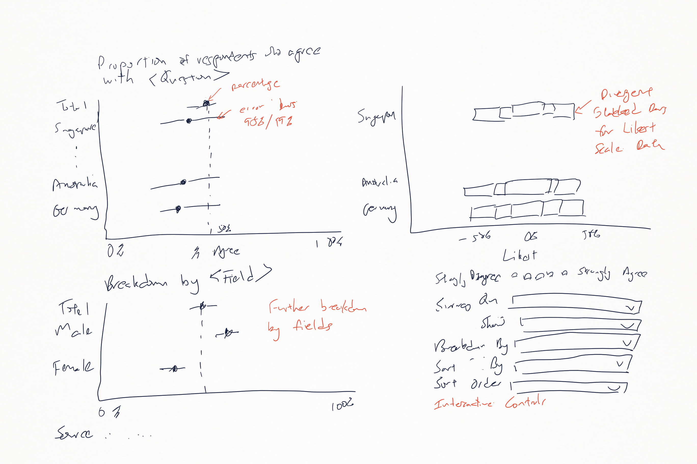

The proposed design comprises three visualisations and a panel with controls.

The visualisation in the top left shows the proportion of survey respondents who agree with a survey question by the various countries. It further includes the 95% and 99% error bars to show viewers the amount of uncertainty based on the number of survey respondents.

The visualisation in the bottom left shows the further breakdown of the survey results by various metrics such as **Age**, **Gender**, **Household Size** or number of **Household Children**.

The visualisation in the top right uses divergent stacked bars to present the survey data for each country.

The controls will allow the viewer to select the following:

-   **Survey Question** - This allows the user to select various questions related to vaccines for analysis, as opposed to using only one question to make a conclusion.

-   **Show Measures** - This allows the user to select what elements to display on the charts, whether to include the actual percentage, the 95% error bars and/or the 99% error bars.

-   **Agree Calculation** - This allows the user to choose which survey responses to include when showing the proportion of respondents who agree.

-   **Breakdown By** - This allows the user to to further breakdown the results by Age, Gender, Household Size, or Household Children.

-   **Sort By** - This allows the user to sort either alphabetically by Country name or by the Value.

-   **Sort Order** - This allows the user to sort in an ascending or descending manner.

The proposed design improves on the original design on the following areas:

-   The controls allow the viewer to choose the survey question and the respective results. This lets the viewer know how people responded, rather than using only a single question to deem how pro-vaccine a country is.

-   The inclusion of error bars provides a better visualisation of the uncertainty around the results. For example, certain countries may have less results and thus there is more uncertainty in the results. Without showing this uncertainty, the viewer may assume that the results are representative of the population of the countries.

-   The second visualisation lets viewers drilldown into the results by more metrics. This allow further analysis of the data to see if there is difference when broken down. For example, we are able to tell how males and females responded.

-   The controls allow the viewer to sort the results in a meaningful way. Sorting by country allows consistent placement to compare across various survey questions, while sorting by value allows comparison on how the different countries responded to the surveys.

-   Divergent stacked bars allow better comparison of Likert scale data as compared to the original.

## 2.3 Proposed Data Visualisation

> c.  Using Tableau, design the proposed data visualisation.

The following is the proposed design for the data visualisation:


The proposed data visualisation has been uploaded to Tableau Public and can be found [here](https://public.tableau.com/views/COVID-19VaccineSurveyResults/VaccineSurveyDashboard?:language=en&:display_count=y&publish=yes&:origin=viz_share_link).

## 2.4 Step-by-step Description

> d.  Provide step-by-step description on how the data visualisation was prepared.

The following sections describe how the data visualisation was prepared.

### 2.4.1 Data preparation

The data used for the visualisations were gotten from the [Imperial College London YouGov Covid 19 Behaviour Tracker Data Hub](https://github.com/YouGov-Data/covid-19-tracker). There was one data file for each country, and the data files had different times when they were last updated ranging from 5 months ago to few days ago. Only countries with data that was updated recently, i.e. in the last 2 weeks, were used for our visualisation. Israel was excluded as it was only added in February 2021. The final data included the following countries - Australia, Canada, Denmark, France, Germany, Italy, Japan, Netherlands, Norway, Singapore, South Korea, Spain, Sweden and the United Kingdom.

Tableau Prep Builder (TPB) was used to prepare our data file. First, all the files were put into the same folder. Next, one of the files was loaded into TPB. The multiple files option in TPB was used to load all the files together as a wildcard union:

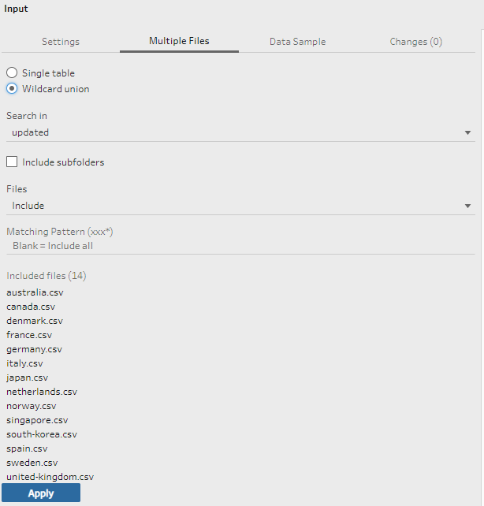

As the date of the files was recognised in the wrong locale, we go to the settings tab to change the date to UK format:


Each data file contained around 400 columns of data and each row of data comprised survey responses and survey respondent demographics. Only data with vaccine related questions (e.g. vac_1, vac2_1, vac3) as well as survey respondents' demographics (e.g. gender, age) were retained. We excluded the other columns of data that were not used. The following columns were retained:

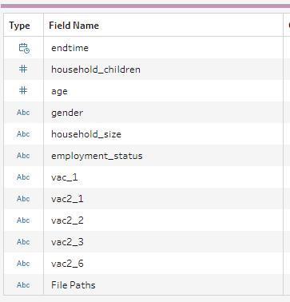

Next, a "clean" step was added. For cleaning, we first filter responses which were in 2021:

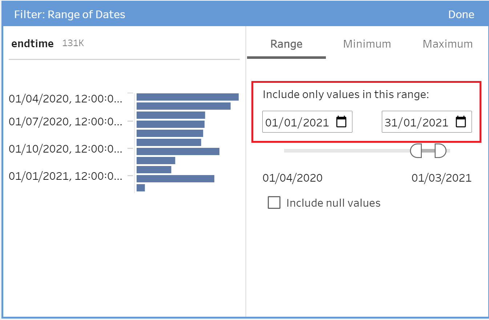

Next, we renamed the file paths column as "Country". We also renamed all the values e.g. australia.csv, singapore.csv to their proper country names e.g. Australia, Singapore by using title case and remove the .csv behind.

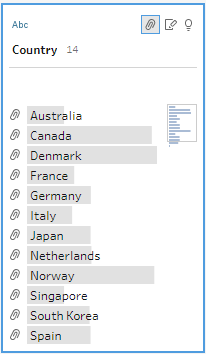

Finally, the prepared data was saved for further use in Tableau:

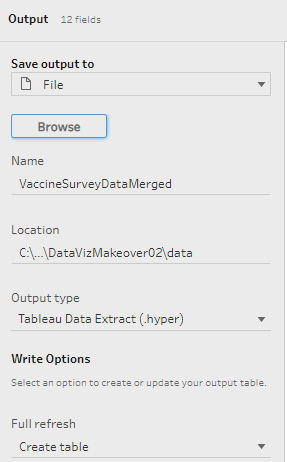

### 2.4.2 Load Data

We first load the data in Tableau by dragging the exported .hyper file into Tableau.

Next, we created groups for the Age, Household Size, and Household Children columns. This allowed us to present the data in an aggregated manner.

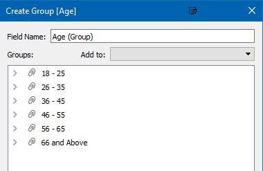


### 2.4.3 Creating Parameters

A new sheet called "Survey Results" was created for the first visualisation. In order to allow interactivity for the visualisations, we create a few parameters.

We first create a parameter to let the viewer choose the survey question. This parameter will be used to control which survey question the visualisation will show the results for. We change the parameter data type to "String" and choose "List" for allowable values. We type in the various values and their corresponding questions in the list below. The questions to values mappings are gotten from the codebook excel spreadsheet included with the data.


We created a corresponding calculated field to select the appropriate column of our data based on the choice of survey question.

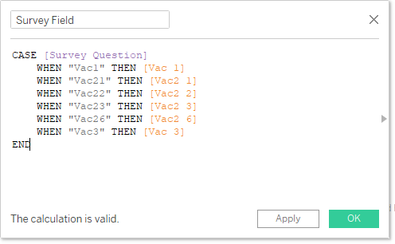

Next, we create a parameter called "Show". We change the parameter data type to "String" and choose "List" for allowable values. We type in the various values and their text to display in the list below. This will allow the viewer to select which elements to show for the visualisations, i.e. whether to show the Actual Mean, the 95% error bar, and/or the 99% error bar.

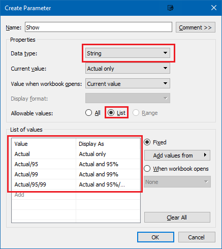

We create a parameter called "Breakdown By" to allow the viewer to breakdown the results by various metrics. We change the parameter data type to "String" and choose "List" for allowable values. We type in the various values in the list below.

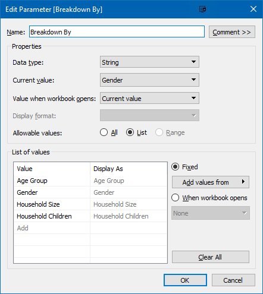

We create a corresponding calculated field to select the appropriate column based on the viewer's selection.


We create a parameter "Agree Calculation" to allow the viewer to choose which survey responses to include when calculating the percentage of respondents who agree, i.e. whether to only use "Strongly Agree" or both "Strongly Agree" and "Agree". We use the integer data type with values of "1" and "2" as these will be used in our formula to calculate the percentage.


Lastly, we create two more parameters "Sort By" and "Sort Order" to allow the viewer to control the sorting. For "Sort By", we use the string data type and allow the viewer to sort by either "Country" or "Value". For "Sort Order", we use the integer data type and use "1" for Ascending and "-1" for Descending. This will be used in a subsequent formula to control the sort order.

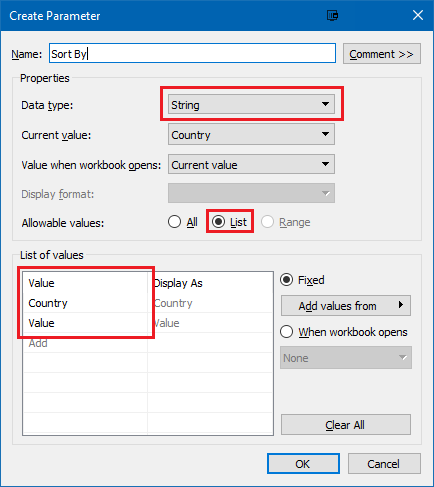


Finally, we right click on all the parameters and select "Show Parameter" to show them on the worksheet.


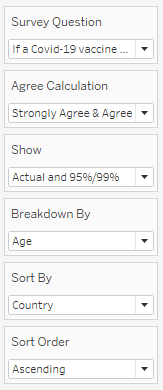

### 2.4.4 Creating Fields for Percentage and Error Bars Visualisation

Next, we create the various fields that will support the visualisation.

We create a calculated field called "Number of Respondents" and set the value to 1. This field will be used to count the number of respondents.

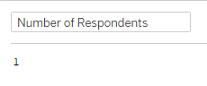

We create a field called "Total Respondents". This field will sum up the total number of respondents, excluding the aggregation at the "Country" level. This field will mainly be used for the title to show the total number of respondents.

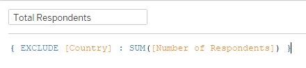

We create a field called "Score". This field will get the score of the data in integer ranging from 1 to 5. Note that the survey responses are "1 - Strongly Agree", "2", "3", "4", and "5 - Strongly Disagree". Hence, we take the leftmost character of the response and convert it to integer to get the score.


Next, we create a field for the percentage of respondents who agree. This is computed by summing the people who meet the threshold set in the "Agree Calculation" parameter and dividing it by the number of respondents.

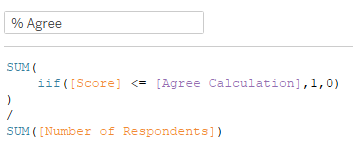

Next, we create a field for the overall average, without aggregation at the "Country" level. Similar to total respondents, this will be used for the title as well as the reference line.

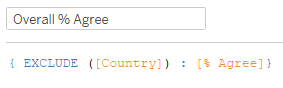

Next, we create two constant fields for the 95% and 99% z score values of 1.959964 and 2.575829 respectively. These will be used to compute the 95% and 99% error bars.


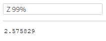

Next, we create a field for "Standard Error". Standard error is computed using the following formula:

$$\sqrt{\frac{percentage * (1-percentage)}{sample size}}$$

This is translated to the following calculated field:


Next, we create the fields to get the margins of error for 95% and 99%. These are computed using the standard error multiplied by the respective z scores.


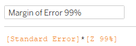

Next, we created four calculated fields for the upper and lower values of both 95% and 99% confidence intervals.


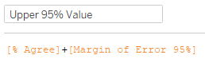

Next, we create the fields that will be used to display the elements on the visualisation. The "Show" parameter created earlier is used to control which elements to show. By checking if the parameter contains the various values, we show the relevant elements as appropriate.

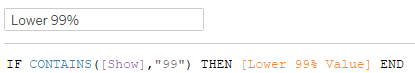


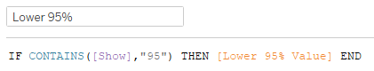

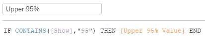

Finally, we create a field called "Sort Field" to control how we sort the elements on the graph. This field will use the "Sort Order" and "Sort By" parameters to decide whether to sort ascendingly or descendingly and by Country or by Value.


### 2.4.5 Creating Fields for Divergent Stacked Bars Visualisation of Likert Scale Data

We next move on to create the fields required for the divergent stacked bars.

We create a calculated field to count the positive responses. Since our survey responses is on a scale of 1 to 5, with 1 being strongly agree and 5 being strongly disagree, we count the number of 1 and 2 and half of responses of 3.

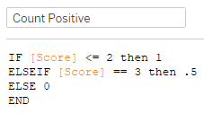

Similarly, we create a field to count the negative responses. We use -1 and -0.5 respectively for negative and neutral responses so that the bars will be towards to left of 0.

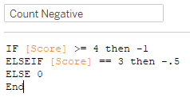

We create a field called "Positive Percentages" to get the percentages for positive responses. This uses the positive count as the numerator and the number of respondents for the denominator. We exclude "Score" from the level of detail as we need to get the total number of respondents and not just respondents for each score.


We similarly create one for the negative responses called "Negative Percentages".

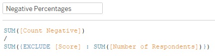

### 2.4.5 Creating Survey Results Visualisation

We first add the "% Agree" field to the Columns shelf and the "Country" field to the Rows shelf and change the mark to circle to display the % who agree as a circle on the visualisation.

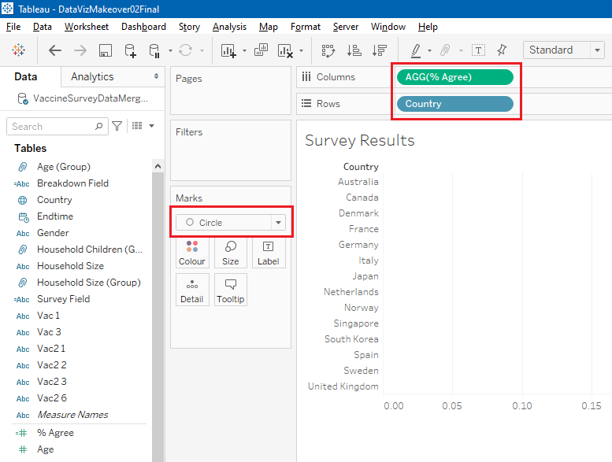

We adjust the x-axis to be fixed from 0 to 1, with tick marks at intervals of 0.1. We also change the format for the x-axis to be in percentage with no decimal places by right-clicking on the axis and formatting it.


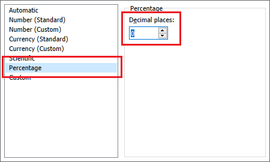

We drag "Measure Values" to the Columns shelf. We remove the irrelevant measures from the "Measure Values" shelf, leaving only the Upper/Lower 95%/99% values. We also sort them by dragging the 99% values on top.

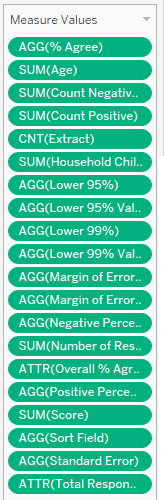

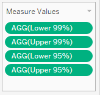

We change the axes to dual axis and synchronise the axes by right-clicking on the second axis and selecting the appropriate option.


We change the "Measure Names" from detail to colour.


We click on the "Colour" icon and change the colours of the 99% values to light grey and 95% values to a darker grey.

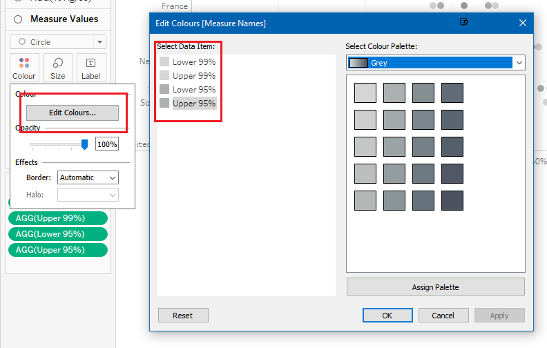

We change the mark type to "Line" and drag "Measure Names" from the left pane to the path icon.


We go back to the previous AGG(% Agree) mark and change its colour to blue.

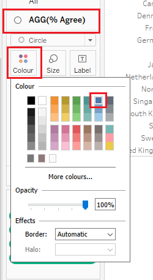

Since the mark for % Agree appears behind the error bars, we right-click on the axis and move the mark to the front.

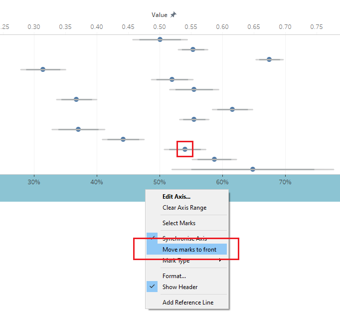

We set the number of format for "% Agree", "Upper 99%", "Lower 99%", "Upper 95%" and "Lower 95%" to percentage by holding "Ctrl" and select them before right-clicking on it on the left pane. We then set the number format to percentage with 0 decimal places.


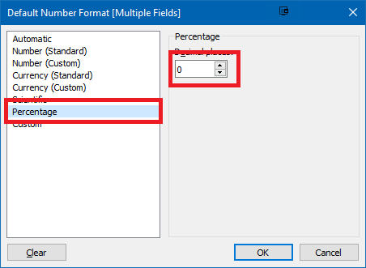

We add "% Agree" to the rows shelf by dragging it from the left pane and change it from continuous to discrete. This allows us to display the % on the left axis.

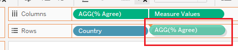


Since we are using calculated fields to show or hide the error bars, we want to hide the indicator that shows that there are null values when we do not show the 95 or 99% error bars. We do this by going to "Analysis \> Special Values \> Hide".


We also hide the top axis since both axes are synchronised. We do this by right-clicking on the top axis and unticking "Show Header".

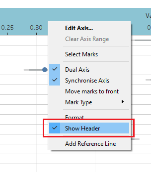

To implement our custom sort using our two parameters, we sort "Country" in the row shelf by right-clicking on it and choosing sort and using our "Sort Field" to sort it.

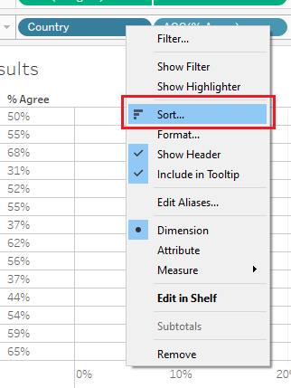

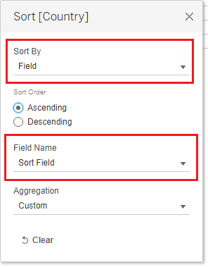

We add another element to show the Grand Total by going to "Analysis \> Totals \> Show Column Totals" and also "Column Totals to Top". This will show us the result for all survey respondents aggregated for all countries.


Next, we drag the "Overall % Agree" field to the detail icon of the "AGG(% Agree)" mark. This will allow us to get a reference line for the overall percentage of people who agree.


We add the reference line to the axis to show the overall percentage of people who agree. We also change the number format for Overall % Agree to percentage.

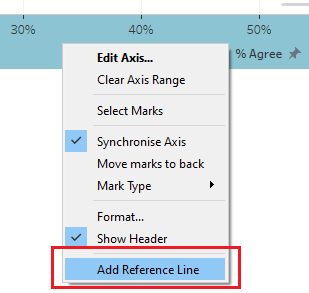

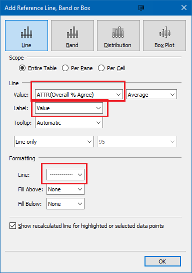

Next, we drag the "Total Respondents" field to the detail icon of "All" marks. This will allow us to use the total number of respondents in the title.


We add a meaningful title to the visualisation by right-clicking on the title and then "Edit title". The title will show the current survey question as well as the overall percent of respondents who agree and the total number of respondents.


We drag the "Number of Respondents" field to the tooltip icon of the All marks. This will allow us to use the number of respondents in the tooltips of the visualisation.

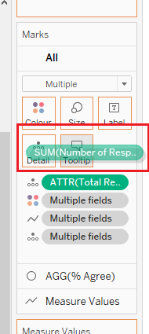

We add meaningful tooltips for % Agree and the Error Bars by clicking the tooltip option of the respective marks.


We scale the visualisation to "Entire View".

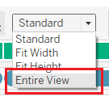

We add animation to the visualisation by going to "Format \> Animations". We set the animation to on and the duration to 1 second.

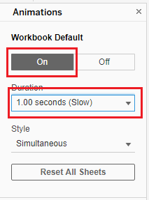

Finally, we get the final visualisation for survey results as follows:


### 2.4.6 Creating Visualisation for further breakdown of results

In order to create another visualisation to breakdown the results, we duplicate the previous worksheet to minimise the number of steps required. We rename the duplicated sheet as "Breakdown of Results".


Since we want to breakdown by another field instead of country, we replace "Country" in the rows shelf with "Breakdown Field" by dragging "Breakdown Field" onto "Country" in the rows shelf.

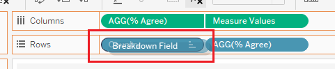

We change the reference line to use the total of "% Agree".


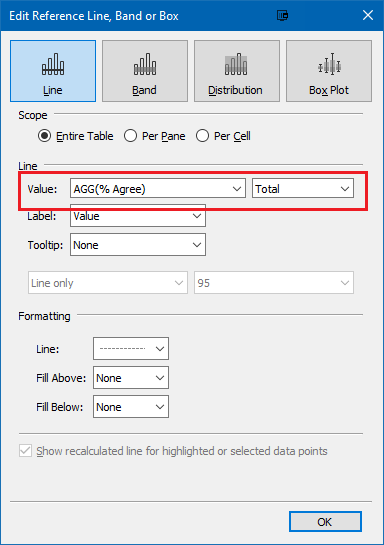

Since we no longer need the total respondents for this visualisation, we remove it from the detail.

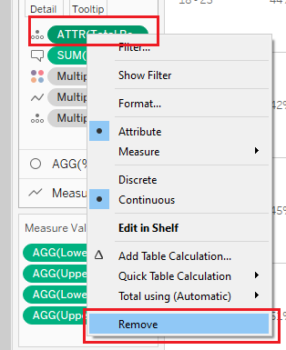

We change the tooltips of % Agree and Error Bars to dynamically display the breakdown by field label:


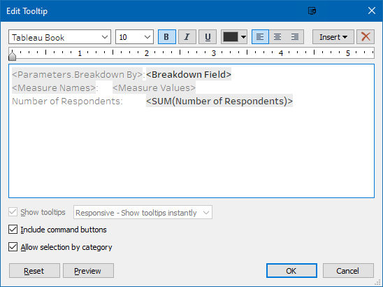

We add a new Action by going to "Worksheet \> Actions". We add a new filter action such that selecting a country on the first worksheet will drilldown the results in the second sheet.

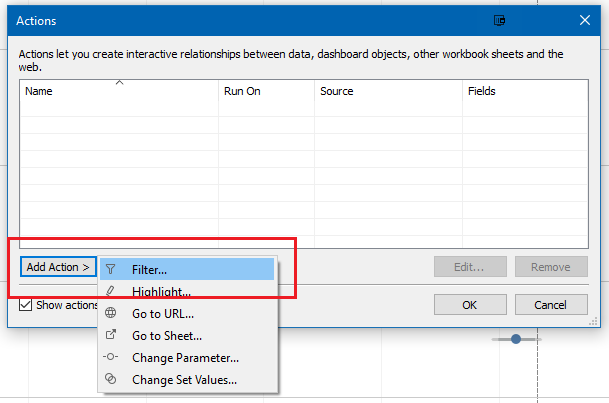

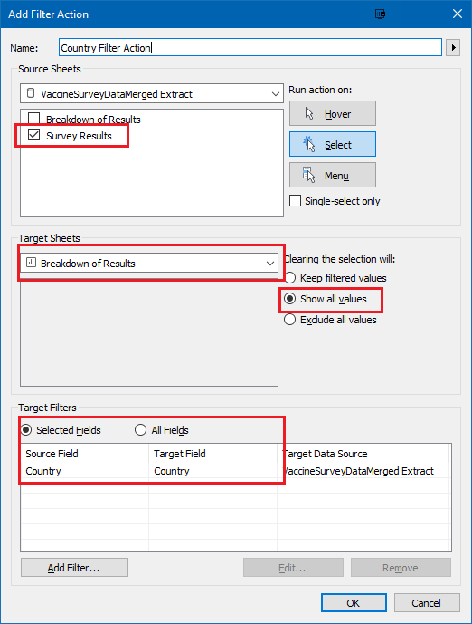

We change the title to let the viewer know the field we are breaking down by and the country if selected.

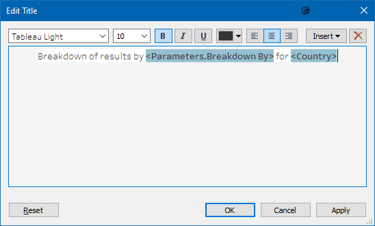

The final visualisation for the breakdown is as follows:

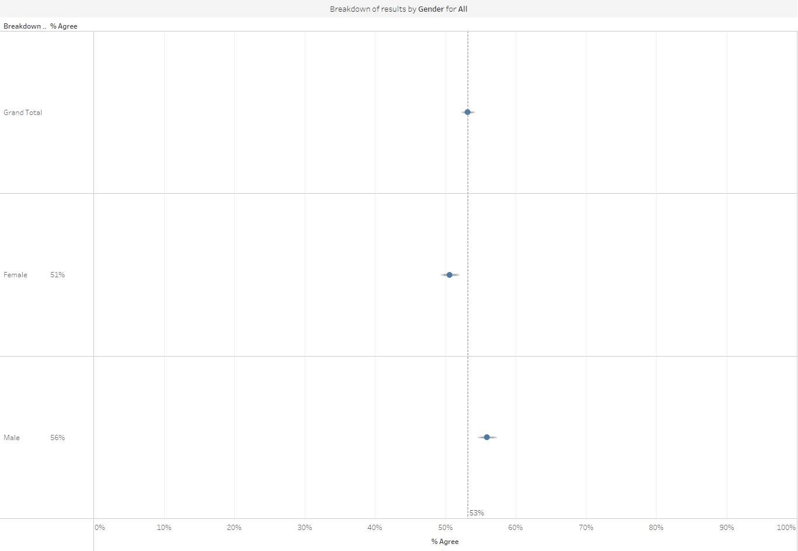

### 2.4.7 Creating Visualisation for Divergent Stacked Bars

We create a new worksheet titled "Likert Results" for the divergent stacked bars visualisation.

We first change the number format of "Negative Percentages" and "Positive Percentages" to percentage.


Next, we drag "Negative Percentages" and "Positive Percentages" to the Columns shelf and "Country" to the Rows shelf.


We sort Country by the "Sort Field", similar to what we did for our first visualisation.


We drag "Score" to Colour to colour the bars by their score. As "Score" is recognised as a continous measure, we need to change it to a discrete dimension instead.


Next, we change the Axes to dual axis by right-clicking on the Positive Percentages axis and clicking dual axis. We further synchronise the axes to make them consistent.


Tableau has automatically added "Measure Names" to colour marks. We remove it as it is not required.


We change the mark type from "Automatic" to "Bar" since we want to show divergent stacked bars.


We change the colour for the bars to use contrasting colours for agree and disagree.


As the bars are not arranged correctly according to their scores, we have to sort the colours accordingly. We do this by right-clicking on the legend items and clicking sort. We manually arrange the colours to make sure the bars are sorted like how we want it.


Since we are using dual axis, we hide the header for the top axis by right-clicking on it and unchecking "Show Header"


We add the Column Totals to the top by going to the Analysis Menu and clicking the respective options.


We add the title and colour coding for the viewer to easily identify what each colour means.


We change the axis title to "% of Respondents".


While divergent stacked bars are useful for comparison across countries, it might not be that intuitive to compare across the responses for each country. Hence we create another worksheet titled "Likert Tooltip" that will contain the visualisation for the tooltip to allow the viewer to compare across the responses.

First, we drag Score to the Columns shelf and "Number of Respondents" to the Rows shelf.


Since Score is recognised as a continuous measure, we need to change it to a discrete dimension.


We also want to change the number of respondents from an absolute value to a percentage of total. We can use a quick table calculation to achieve this.


We want to colour the bars by the scores and so we drag "Scores" to the colours icon. Similarly, we have to change score to a discrete dimension.


We want to add the % of respondents to the label of the graph. We drag "Number of Respondents" to the Label icon and use a quick table calculation to change it from an absolute value to percentage of total.


We want to give meaningful labels to the scores. We right click on "Score" in the Columns shelf and click Edit Aliases. We give the scores meaningful labels.


In order to put the negative bars to the left and the positive bars to the right, we sort the "Score" in the Columns shelf in a descending order.


Since we are using this worksheet as a tooltip, we hide the y axis and the title. We further scale the graph to fit the "Entire View". The final tooltip is as follows:


We add the completed worksheet to the tooltip of the previous visualisation. Note that we have to filter by "Country" so that it will show all responses for the country.


The final product of this visualisation is as follows:


### 2.4.8 Combining it together into a Dashboard

Finally, we create a Dashboard titled "Vaccine Survey Dashboard" to combine the visualisations. The following steps were done to create the dashboard:

1.  Drag all three worksheets to the dashboard area to their respective areas and drag the controls to the bottom right.

    

2.  We remove "Measure Names" and "Score" legend from the bottom right.

    

    

3.  We resize the areas for the various visualisation for aesthetic purposes.

4.  We add the source and author information below.

5.  Since the filter action was created earlier, we need to adjust it to work for the dashboard. We adjust the action based on the filters below.

    

The final product of the proposed visualisation in the form of a dashboard is as follows:


## 2.5 Major Observations

> e.  Describe three major observations revealed by the data visualisation prepared.

Using the proposed data visualisations, we can observe the following:

1.  More people would like to adopt a "wait and see" approach for getting the vaccine. Comparing the responses for the question on whether they are willing to take the vaccine this week against whether they are willing to take the vaccine a year from now, the percentage of people who agree increased for all countries except for Germany. The overall percentage increased from **52.47%** of respondents who were willing to get the vaccine immediately compared to **59.56%** one year later.

    

    

2.  Older people were generally more willing to take the vaccine as compared to younger people. This could be due to the fact that they are less worried about potential side effects of the vaccine as compared to younger people. We can see from the image below that about **42%** to **44%** of younger people in various age groups within the **18 to 45** range wanted to get the vaccine once it was available, compared to **51%** and **58%** for the age groups **46 to 55** and **56 to 65** respectively. Finally, people aged **66 and above** were most willing, as **72%** of that age group agreed to it.

    

3.  Females were more worried about the potential side effects of a COVID-19 compared to males. This can be seen from the results where the proportion of females in all countries exceeded the proportion of males who agreed that they were worried about the potential side effects. The figure below shows the overall difference, where **54%** of females were worried compared to **42%** of males.

    

4.  The residents of Japan have less believe in their Government to provide them with an effective vaccine. This can be seen by the fact that despite **68%** (highest among all countries) of them being worried about getting COVID-19, only **47%** (2nd lowest among all countries) believe that their Government will provide them with an effective vaccine and **37%** (3rd lowest among all countries) of them were willing to take a vaccine this week. This has also been observed in the following article **Survey: Japanese less trusting of government in health crisis**, which shows that the Japanese are less trusting of government in a health crisis.

    

    

    

# 3. Conclusion

In this post, we look at how to present vaccine survey data for various countries. We identify areas of improvement in terms of clarity and aesthetics for the chart and propose changes to improve the visualisation. We further added interactive elements to enhance viewers' experience to analyse the data. We implemented the changes in Tableau and were able to arrive at more insights than the original visualisation.

# 4. References

1.  Wexler, S. (2018, August 20). Showing uncertainty in survey results. Retrieved February 15, 2021, from <https://www.datarevelations.com/resources/showing-uncertainty/>
2.  Wilke, C. O. (2019). 16 Visualizing uncertainty. In *Fundamentals of data visualization: A primer on making informative and compelling figures*. Retrieved February 15, 2021, from <https://clauswilke.com/dataviz/visualizing-uncertainty.html>
3.  Wexler, S. (2018, April 1). Rethinking the divergent stacked bar chart - placing the stronger views in the center. Retrieved February 15, 2021, from <https://www.datarevelations.com/resources/rethinkingdivergent/>
