```{r setup, include=FALSE}
knitr::opts_chunk$set(echo = FALSE)
```

# 1. Introduction

This post will be looking at an interactive data visualisation created to reveal the spatio-temporal patterns of armed conflict in selected South-east Asia countries between 2010-2020 and to identify possible areas of improvement. A screenshot of the original visualisation is shown below. The original visualisation can be found at [here](https://public.tableau.com/profile/tskam#!/vizhome/South-eastAsiaArmedConflictAnalysis/South-eastAsiaArmedConflictAnalysis){.uri}. The data was sourced from the [The Armed Conflict Location & Event Data Project](https://acleddata.com/) and the data used was the data set from January 2010 to October 2020 for South East Asia.

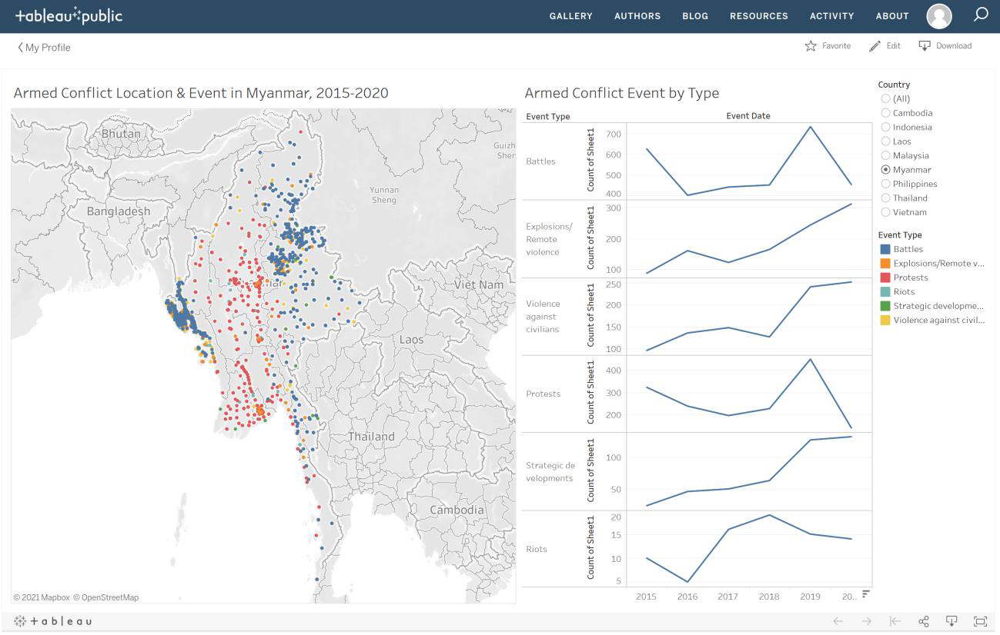

We will also come up with a proposed design and implement it in tableau. Next, a step-by-step guide will be provided for coming up with the proposed design. Finally, we will list down major observations that we are able to derive from the proposed design.

# 2. Task

The tasks can be summarised as follows:

1.  Critic the existing visualisation
2.  Sketch a proposed design
3.  Implement the proposed design
4.  Provide steps for replication of the proposed design
5.  Major observations derived from the proposed design

## 2.1 Critic

> a.  Critic the interactive data visualisation from its clarity, aesthetics and interactivity. At least two from each evaluation criterion.

In terms of **clarity**, the following areas could be improved:

1.  There is no lead in paragraph for the visualisations, making it hard to determine what message is being conveyed to the viewer.

2.  The visualisation of the map on the left does not really allow for spatiotemporal visualisation. The map comprises of all events across the years 2015 to 2020, and does not allow the user to visualise over the temporal plane. Further, the graphs on the rights show the breakdown of the events by year, but there is no easy way for the user to visualise that on the map, leading to a disjoint.

3.  The title of the visualisation states that the visualisation was from 2015-2020. The axis labels of the graphs on the right similarly shows that the data is from 2015 to 2020. However, upon further examination of the visualisation by expanding the date axis from yearly to monthly, we can see that the data is only up till October 2020, rather than till the end of 2020. This may not be clear to the viewers who would expect that every year represents the full 12 months. It also makes it difficult to make comparisons between the difference years.

    

4.  The line graphs on the right are difficult to compare because they are on separate graphs. Further, the axes for the different events were of different scale and range, further exacerbating the problem of comparing across different event types.

    

5.  The point marks on the map are difficult to visualise due to cluttering once there are too many points in the same area.

    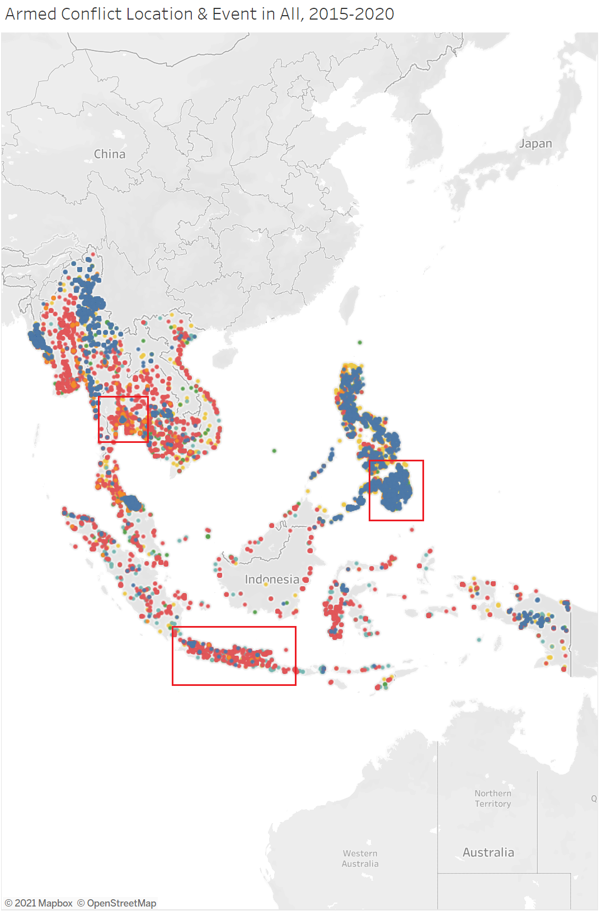

6.  The colour of the line graphs on the right are not consistent with the legend; the legends uses different colours for different event types, but the line graphs are all of the same colour.

7.  The source of the data was not provided and therefore the viewer may not know where the data was sourced from.

In terms of **aesthetics**, the following areas could be improved:

1.  The axis label of the graphs on the right could be improved. It is written as "Count of Sheet1", but the user does not know what "Sheet1" refers to.

2.  The axis label of the graphs on the right is vertically aligned and is difficult to read.

In terms of **interactivity**, the following areas could be improved:

1.  The visualisation loads with only Myanmar selected. It would make more sense if the visualisation defaulted to "All" countries, and thereafter allow the user to select by country if desired.

2.  The interactivity of the visualisation could be improved by allowing users to select the year to display, rather than displaying all the events from 2015 to 2020.

    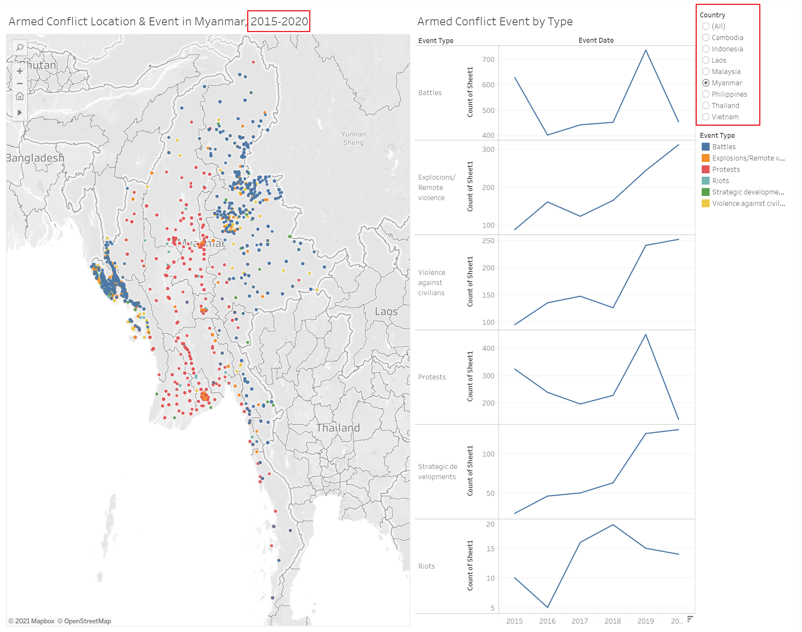

3.  The tooltips of the points on the map does not provide additional meaningful information. It shows the event ID which is difficult to decipher, the event type which can be inferred from the colour of the point, and the latitude and longitude which can similarly be inferred from where the point is.

    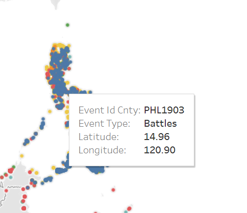

4.  There is no interactivity between the map visualisation on the left and the line graphs on the right. It could be improved by allowing users to select subsets on the line graph to display where these events took place on the map on the left.

## 2.2 Sketch of Proposed Design

> b.  With reference to the critics above, suggest alternative data visualisation and interactive techniques to improve the current design. Support your design by describing the advantages or which part of the issue(s) your alternative design try to overcome.

The following is a sketch of the proposed design:


The proposed design comprises of a map visualisation on the left and line graphs on the right. To the right there will be filters for the user to filter the views by as well as the legends.

The map visualisation on the left includes a dropdown selection at the top which will allow users to toggle between an **all** view, a **density** view and a **point plot** view. The density view shows the density of the number of events on the map broken down by the different event types in a trellis view. Similarly, the point plot view will show individual events on the plot broken down by the different event types in a trellis view. Further, the points are sized by the number of fatalities. The all view will show both the density view and point plot view. The arrangement of the maps in a 3 x 2 trellis allows for easier comparison across the different events. When the user hovers over a point on the map, a tooltip will display which will show further information of the individual events.

The line graphs on the right shows the **number of events**, **number of fatalities**, and **number of fatalities per event** broken down by the various event types and across the different years. The lines are also coloured by the different countries to allow users to compare across the different countries.

The filters on the right allows the user to filter the data across different columns like country. Further, actions between the various visualisations allow the user to select items on one graph that will change the view for the other graphs.

## 2.3 Proposed Data Visualisation

> c.  Using Tableau, design the proposed data visualisation.

The following is the proposed design for the data visualisation:


The proposed data visualisation has been uploaded to Tableau Public and can be found [here](https://public.tableau.com/views/SpatiotemporalAnalysisofArmedConflictsinSouthEastAsia/Dashboard?:language=en&:display_count=y&publish=yes&:origin=viz_share_link).

The proposed design improves on the original visualisation in the following ways:

-   There is a density plot to aggregate events to allow users to visualise where there are more events or fatalities. This improves on the original plot which had cluttered points that overlapped each other.

-   There are filters for the user, allowing them to filter the view by event type, country and date. These filters are also applied consistently across all visualisations.

-   The trellis view allows the user to view the different event types on different maps, rather than cluttering everything into one map.

-   There are controls for the user to fine tune how they view the visualisation.

-   The tooltips for the visualisations are more informative.

## 2.4 Step-by-step Description

> d.  Provide step-by-step description on how the data visualisation was prepared.

The following sections describe how the data visualisation was prepared.

### 2.4.1 Data Loading

The data used for the visualisations was gotten from the [The Armed Conflict Location & Event Data Project](https://acleddata.com/ "The Armed Conflict Location & Event Data Project"). We used the dataset for South East Asia with events from Jan 2010 to Oct 2020.

First, we load the dataset in Excel format into Tableau by dragging it into Tableau. The important columns we need have been recognised as the correct data type. For example, Event Date is recognised as a date time column, Country is recognised with the geographic role of country, and Latitude and Longitude have been recognised correctly as well. Although Admin1, Admin2 and Admin3 are columns with location information, they have been recognised as string. However, we do not change their roles as they will not be used for this visualisation.

### 2.4.2 Creating Parameters

In this section, we detail the steps to create parameters that will be used to allow interactivity for our visualisation.

We first create a "Map View" parameter that will be used to control which map to show on the map view. The data type is changed to String and allowable values is changed to List. We allow the values All, Density and Point for the various views.


Next, we a create a View Parameter. This parameter will be used to control whether to show the map, the graph, or both. The settings for this parameter is as follows:

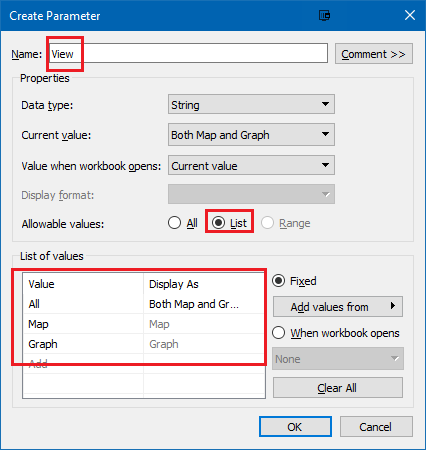

Next, we create a "Density Field" parameter that will be used to control how density on the map is displayed, either by the number of events or the number of fatalities.

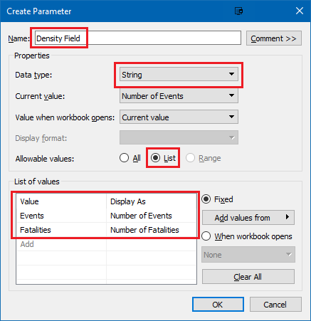

Next, we create a parameter "Point Size (Fatalities) to allow the user to control the size of the points on the plot. The points will be sized by the number of fatalities for that event and will default to 1X size. However, the user can choose to change the size to 0.5x or 2x, or to not size it by fatalities at all. A new float parameter will be created as follows:


Last, we create a parameter to control how to breakdown the line graphs. This parameter will allow the user to breakdown by Country (default), Sub Event Type, or not break down at all. The following settings are used for this parameter:


### 2.4.3 Creating Density Map

We rename the default created **Sheet1** to **Map-Density**. This sheet will be used to create the density view of the map.

In order to get the trellis view for the density plots, we create two calculated fields for Column and Row to get the column and row values based on the event types. For example, the first event type will be Column 0 Row 0, and the second event type will be Column 1 Row 0, and so on so fort. The formula for the calculated fields are as follows:


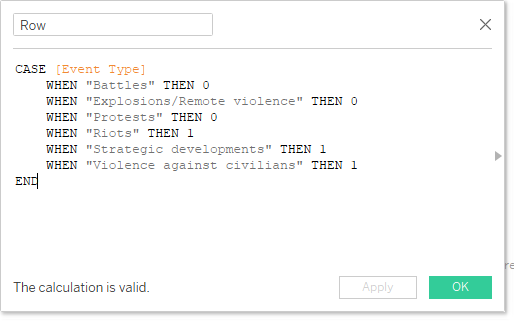

Both the Row and Column fields are changed to dimensions by right-clicking on it and converting it to a dimension:

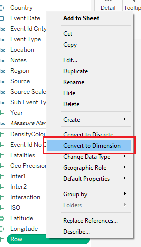

Next, we create a DensityColour field that controls how the density plot is coloured by, i.e. by the number of events or the number of fatalities. The following is the formula for this field:

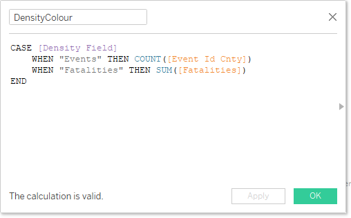

Next, we add the fields to the column and row shelves by dragging them from the left pane. We add the Column and Longitude fields to the column shelf and the Row and Latitude fields to the row shelf:


As we want the longitude and latitude to be counted as individual data points rather than aggregated to an average, we change them to dimensions instead:

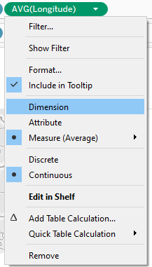

Next, we change the mark type to density to get a density plot on the map:

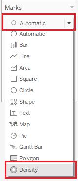

Next, we change the settings for the colour scheme of density, increase the intensity, and decrease the opacity:

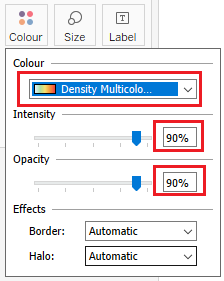

As we do not need the column and row axis labels, we hide them by right-clicking on the values and unticking "Show Header":

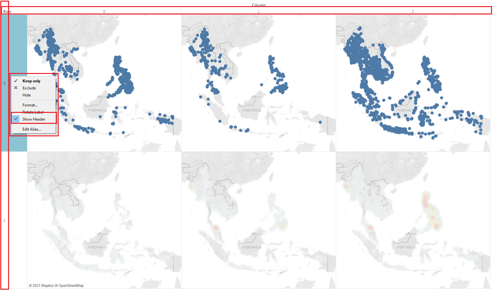

Next, we add our previously created DensityColour field to the colour icon of the marks. This will allow us to control how the density is coloured through the parameter we created earlier:

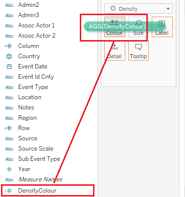

We add the Density Field parameter to the right of our visualisation to ensure we can control how the density of the plot is calculated. Toggling between both settings will change how the density is visualised on the map.

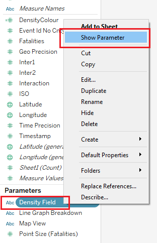

Next, we want to add a filter for Event Date to allow users to choose the date range they would like to visualise. We drag Event Date to the Filters shelf and use Range of Dates with the default settings for the user to filter by. We also right click on the Event Date filter in the filters shelf to "Show Filter" so that it is added to the right of the visualisation.


Next, we add the filters for Country and Event Type by right-clicking on the field on the left pane and clicking show filter. We change the filter type of Country to Multiple Values (dropdown) and Event Type to Single Values (dropdown).

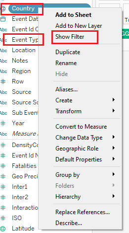


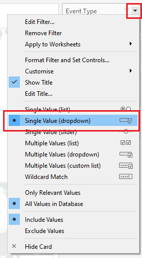

Next, we want to add the label for the event type to the individual maps to allow the user to know which event type each map represented. This proved more challenging due to some limitations of Tableau and the way we set up the Trellis Map. In the end, we used the label mark function to achieve it somewhat. We first drag the Event Type to the Label icon.

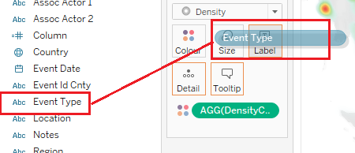

Next, we change the label settings by clicking on the label icon. The following settings were used:


Next, we want to add the parameter that controls which map to show. Even though we have not done up the other map, we can still test it for the current worksheet to ensure it works. First, we right-click the "Map View" parameter and click on "Show Parameter" to add it to the right of the visualisation:

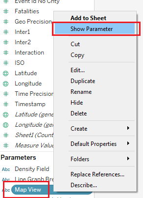

Changing the selection on the dropdown list does not change anything at the moment. Therefore, we need to set up a filter to ensure the sheet is shown or hidden correctly. We first create a new calculated field called "Map Display". This calculated field is required as we are not able to filter by parameters. Therefore, the calculated field will just take the value of the "Map View" parameter:

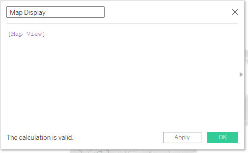

We then drag this new field to the Filters shelf. We want this sheet to be shown when map view is set to either "All" or "Density". As such, our settings for the filter will be as follows:

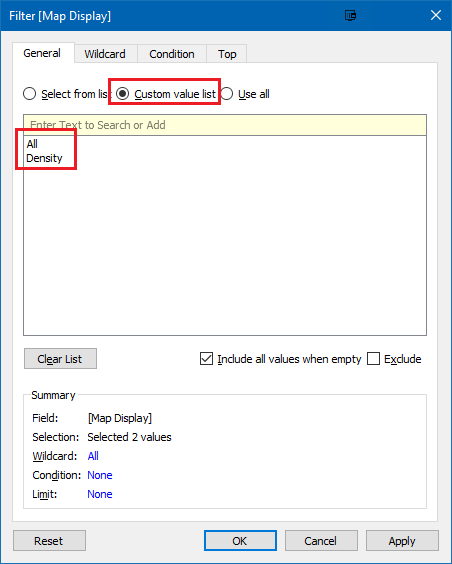

Toggling between the settings will show or hide the map accordingly. However, the title will of the sheet will remain there throughout. As such, we need to use a small hack to show the "title" together with the map. First, we hide the current worksheet title by right-clicking on it and clicking "Hide Title":


To add the title, we created a new calculated field called "Density Title" with the following formula:


We drag this new field to the Columns shelf:

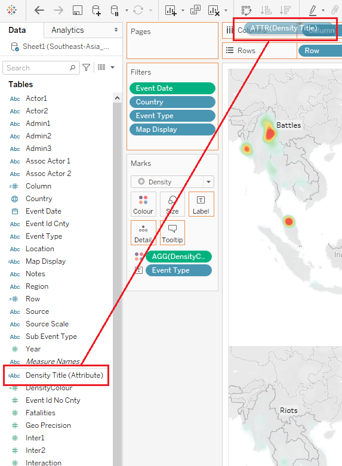

The new "title" is now shown at the top of the map. We right-click on the field label at the top to hide it so that only the "title" is shown:

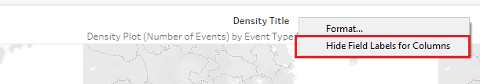

Next, we add fields that will be used for our tooltip by dragging them over to the tooltip icon. We add the count, fatalities, event type, sub event type, country fields to the tooltip. We then use the fields in the tooltip:

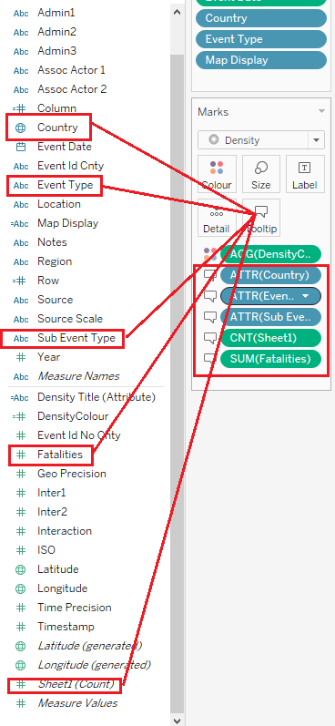


Our final visualisation for this plot is as follows:


### 2.4.4 Creating Point Plot Map

In order to create the point plot map, we duplicate the Map-Density sheet and rename it as Map-Points. We first change the mark type from Density to Circle:

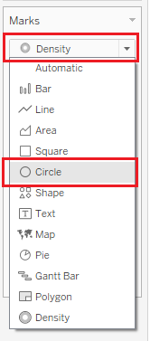

We want to show every individual event as a circle on the map. Hence, we drag "Event Id Cnty" to the detail icon:

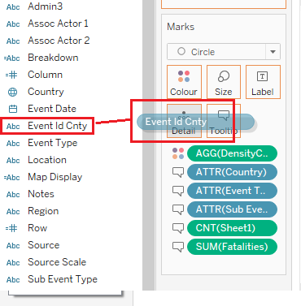

After adding Event Id Cnty to detail, our trellis consisted of one map per event. This was due to how the density title computed the min and max date. We created a new Point Title field and replaced the title with this newly created field.

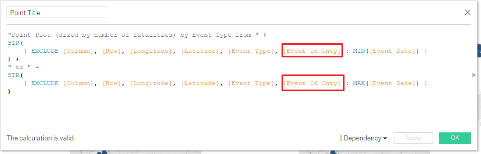


We want to shape the circles by the number of fatalities. We had previously created a parameter to control the size of the circles. We create a new calculated field which uses the sum of fatalities multiplied by the value of the parameter:


This field was then dragged to the size icon to determine the size of each circle:

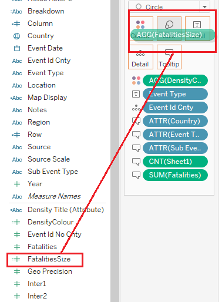

Next, we want to colour the circles based on how we will colour the line graphs later. This is determined by the line graph breakdown parameter. We create a new calculated field for this:

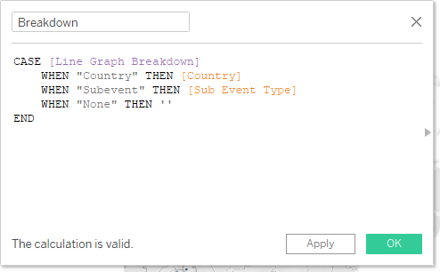

We drag this new field to replace Density Colour on the marks shelf:


We add the Notes field to the tooltip icon and change the tooltip to as follows:


The final visualisation for this sheet is as follows:

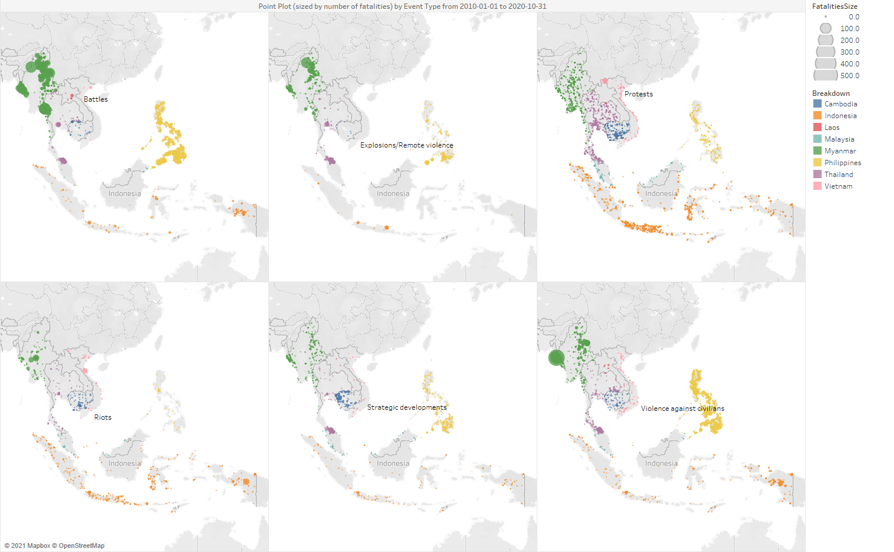

### 2.4.5 Creating the Line Graphs

Next, we create a new sheet called LineGraphs to contain the line graphs. First, we create calculated fields for the number of events and the fatalities per event:

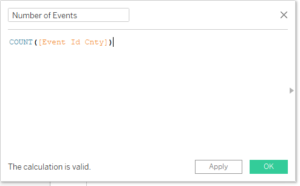


We drag the number of events, fatalities, and fatalities per event fields to the Rows shelf, and the Event Type and Event Date to the Columns shelf:

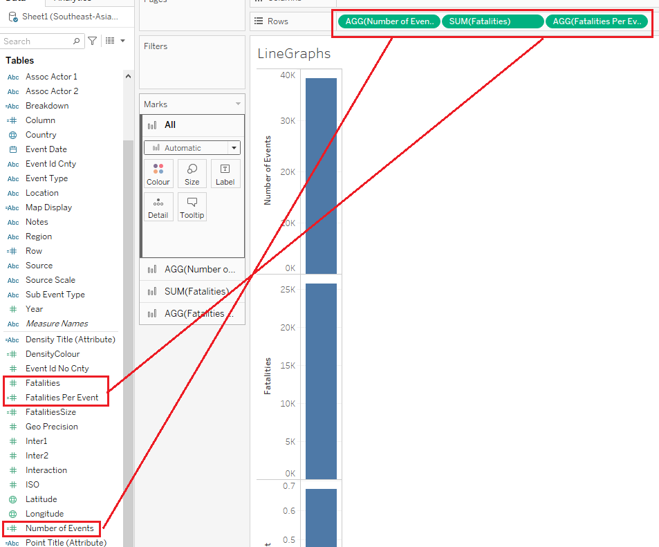

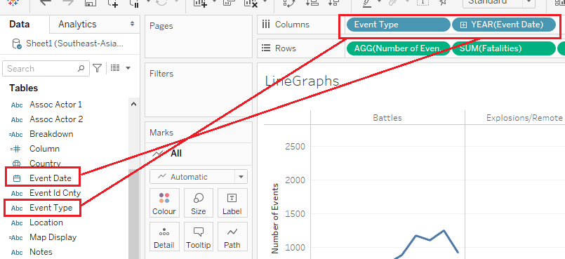

We change the Event Date type from discrete to continuous:


Similar to our point plot, we want to breakdown the graph and colour it by our breakdown field. We do this by dragging the breakdown field to the colour icon:


In order to create dynamic tooltips, we create a new sheet called "Line-Tooltip" to create a tooltip visualisation. We create two new calculated fields to determine the breakdown for country and breakdown for sub event type. These calculated fields will be used opposite to the breakdown type the user has selected. For example, if the user has selected to breakdown by country, the breakdown-country field will be empty:


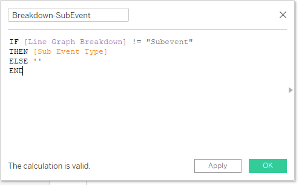

We add the "Measure Names" and "Measure Values" fields to the Columns shelf and the "Breakdown Country" and "Breakdown SubEvent" fields to the Rows shelf:

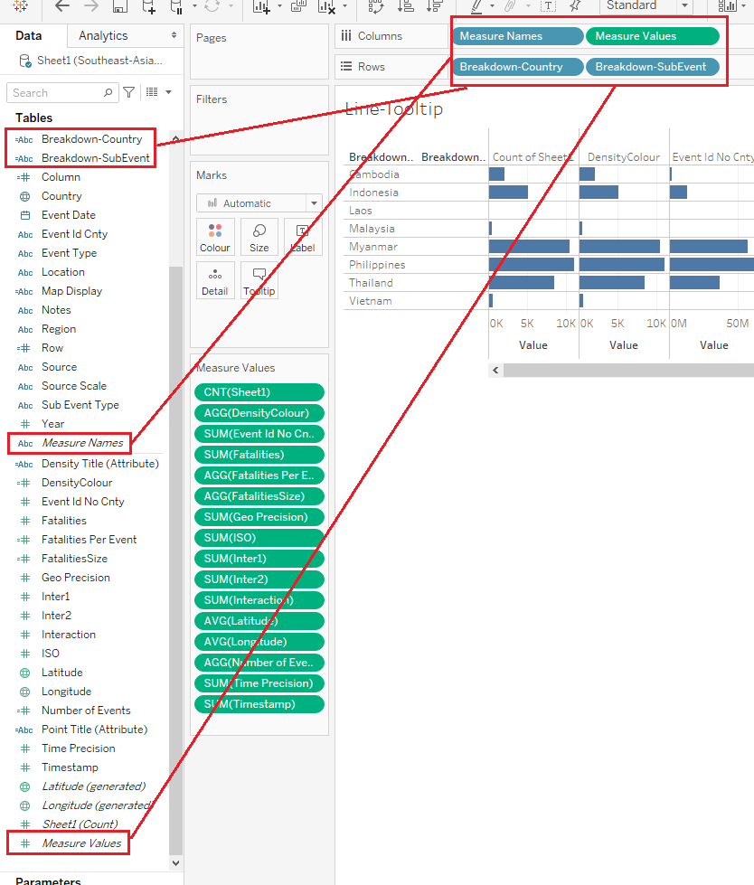

As we only need the Number of Events, Fatalities and Fatalities Per Event, we drag the rest of the measure values and drop it outside to remove them, retaining only those we need:


Next, we colour the graphs by the breakdown-country and breakdown-subevent fields:


We add the measure values to the labels:


We remove the axis header as it is no longer needed by right-clicking on it and unticking "Show Header":

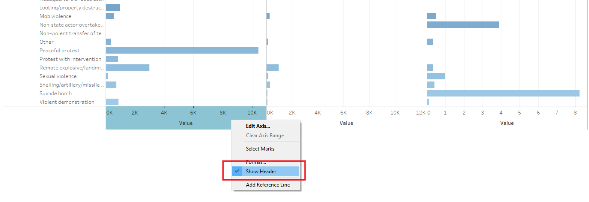

Next, we go back to the LineGraphs sheet to and change the tooltip to as follows to include the new sheet we just setup:

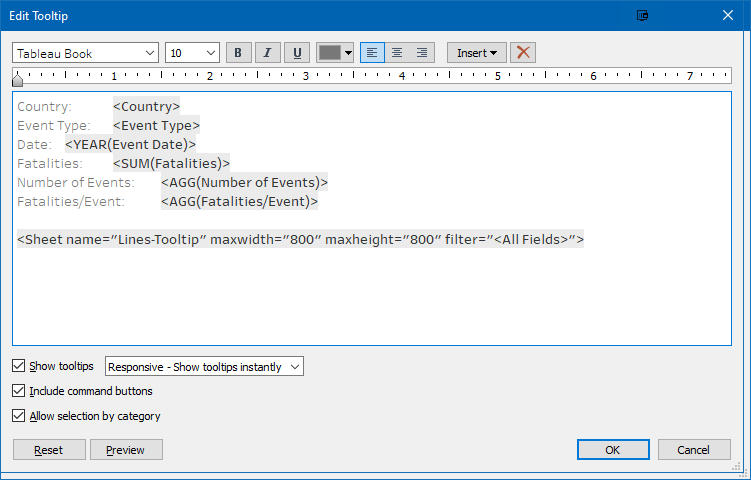

### 2.4.6 Putting it all together into a dashboard

Next, we create a new dashboard called "Dashboard". We first add the LineGraphs sheet to the dashboard:

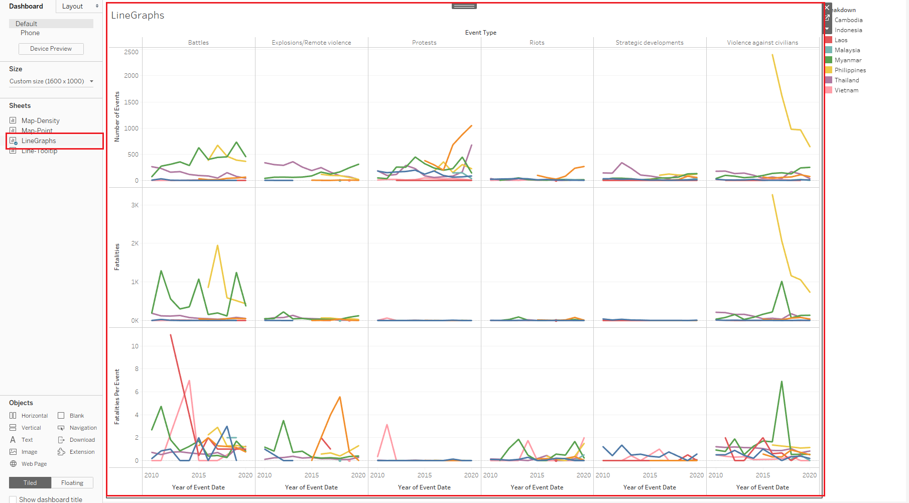

Next, we add a vertical container to the left of the line graphs:

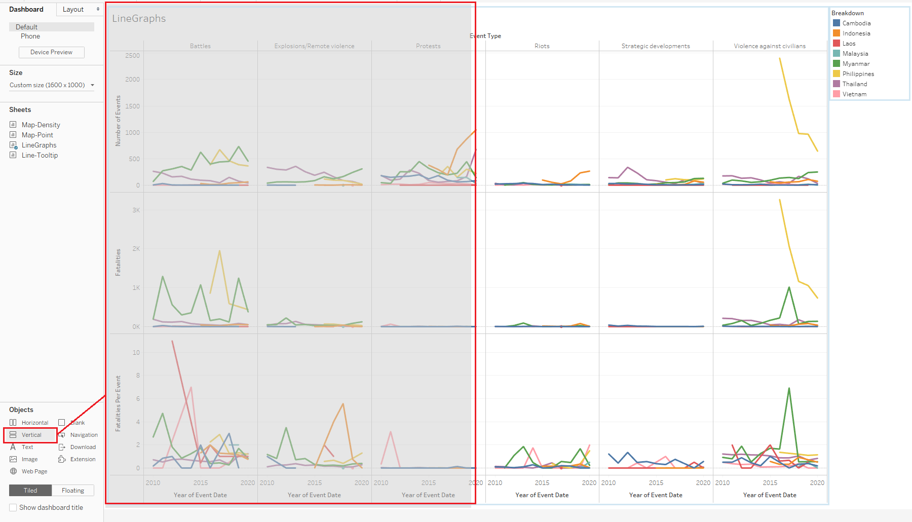

We add the density map to the newly created vertical container:

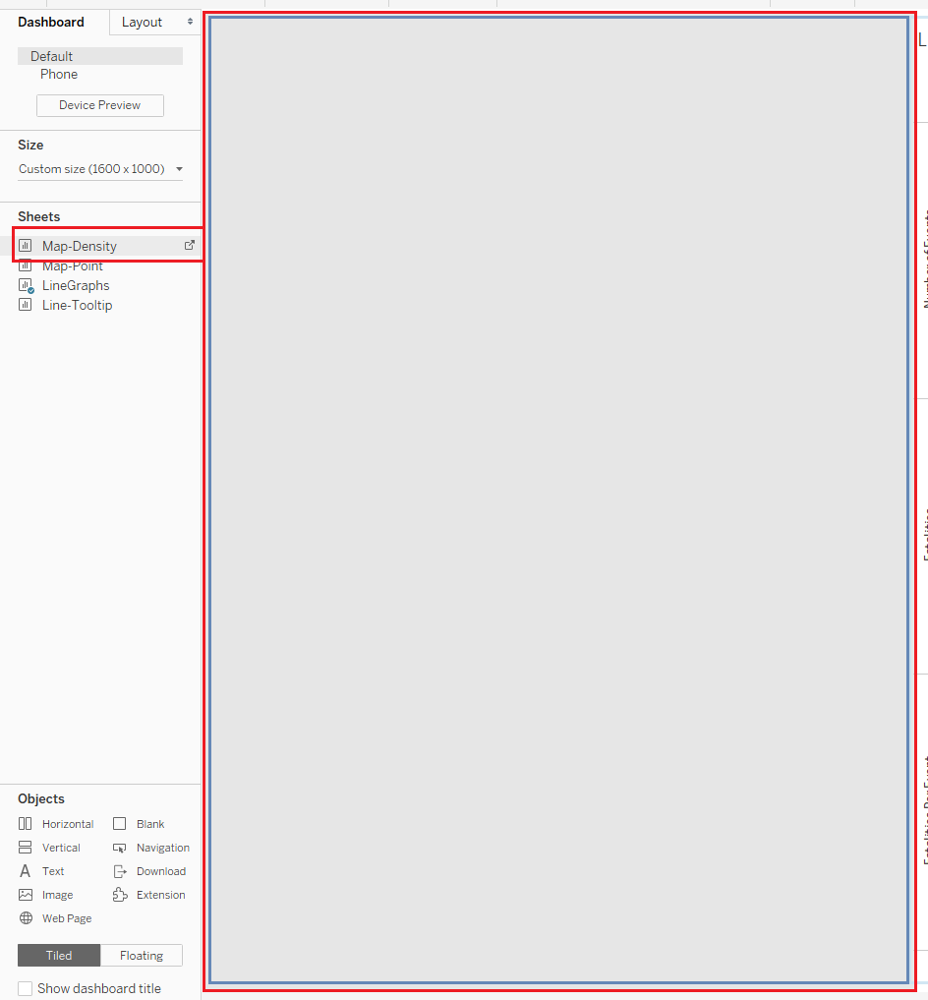

Next, we add the point plot below the density map:

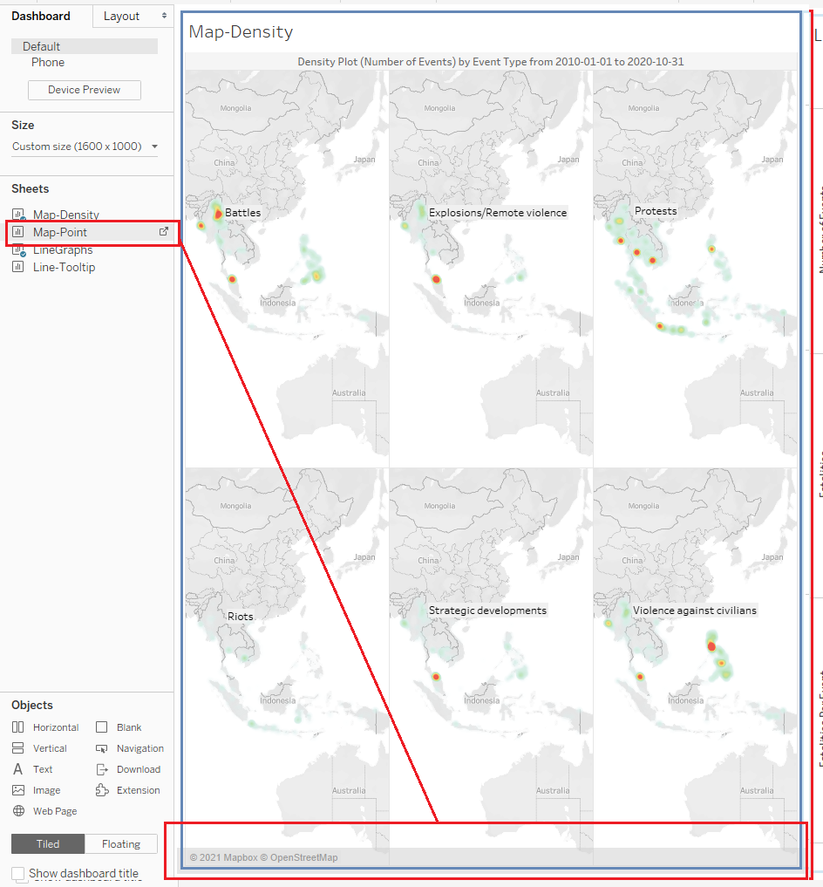

We hide the title of the graphs by right-clicking on it and hiding the title:

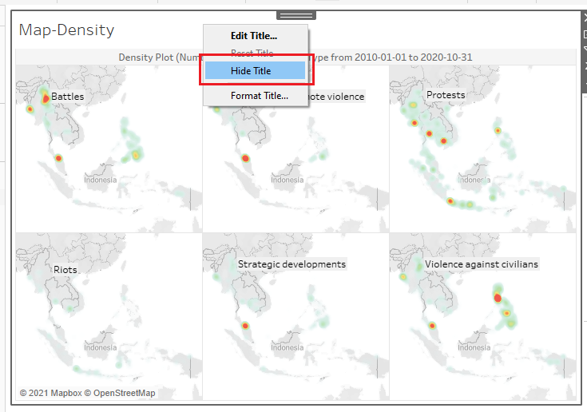

We make sure that all the filters are applied across all visualisations by changing their settings:


Next, we make sure that any selections on any visualisation will change the selection for other visualisations as well. This can be achieved by a Filter Action as follows:


Next, we rearranged the various parameters and filters, and added a title, source and notes to the bottom.


The final dashboard is as follows:

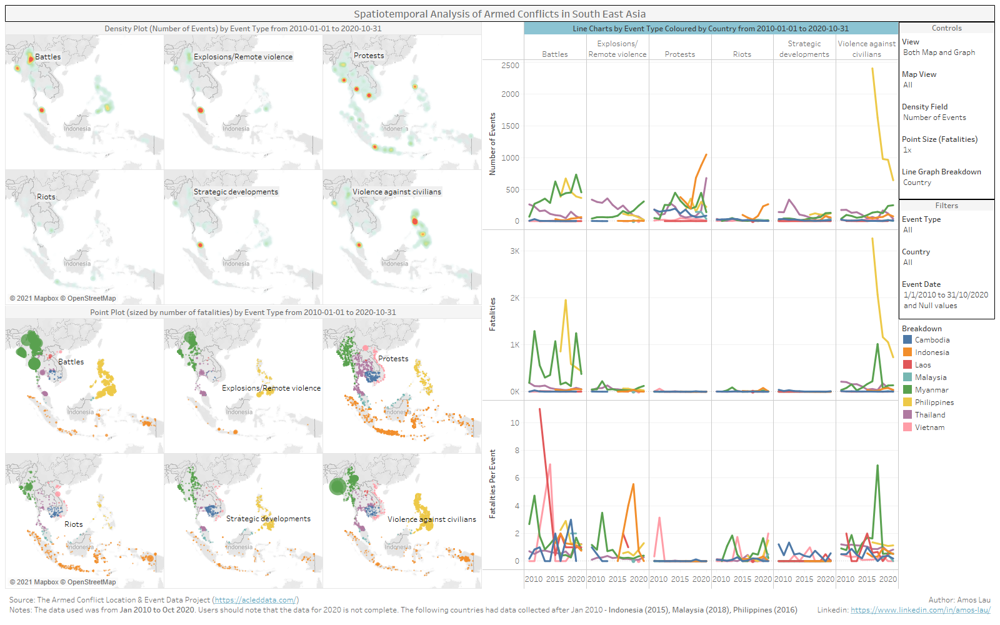

## 2.5 Major Observations

> e.  Describe five major observations revealed by the data visualisation prepared.

Using the proposed data visualisations, we can observe the following:

1.  The number of protests in South East Asia has been steadily increasing, from **424** in **2010** to **2,224** for the **1st 10 months of 2020**. Thankfully, the protests did not result in many fatalities.

    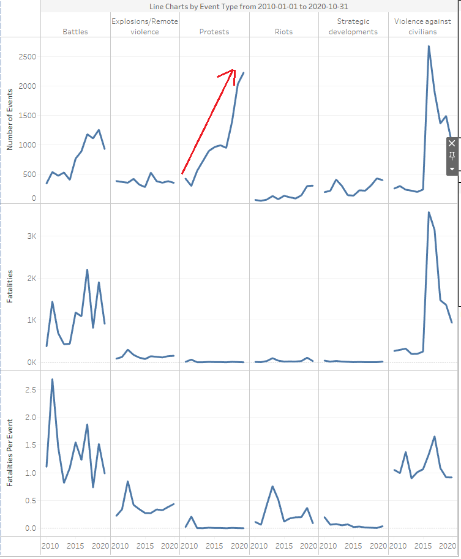

2.  Philippines contributed to the highest number of events and fatalities across all countries, years and event types in the violence against civilians event type in 2016. She had a total of

    

    

3.  There were many deadly events in both Myanmar and Philippines as evident in the density plot and point plot. While both ranked high in fatalities, Myanmar had more deadly events as can be seen by the size of the circles in the point plot.

    

4.  The number of fatalities resulting from armed clashes and violence against civilians were much higher than the other event types. This is to be expected for armed clashes, but is a worry trend for violence against civilians as civilians are usually less armed than the other actors such as military. We can see that Myanmar and Philippines had the most events of violence against civilians, but Myanmar had the higher fatalities per such event.

    

    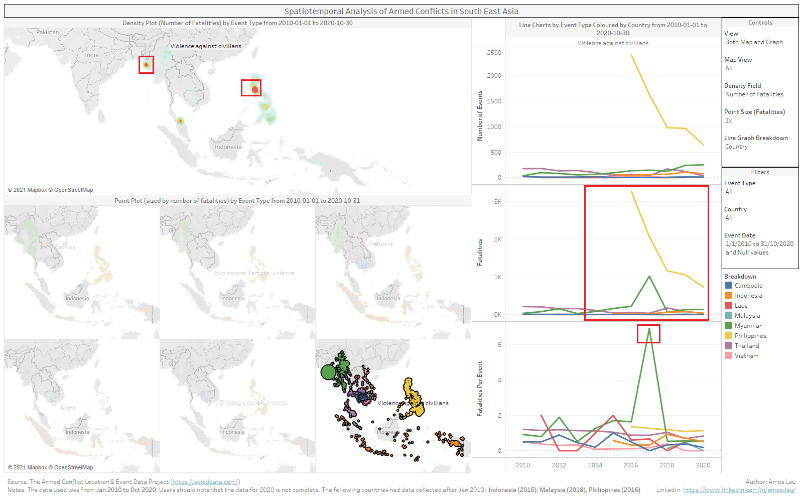

5.  Myanmar, Thailand and Philippines were the countries with the hotspots for battles, explosions or remote violence, protests, and violence against civilians.

    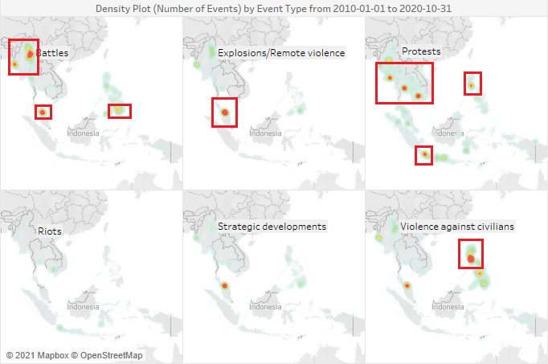

# 3. Conclusion

In this post, we look at how to present conflict data for South East Asia. We identify areas of improvement in terms of clarity, aesthetics and interactivity for the existing visualisation and propose changes to improve the visualisation. We implemented the changes in Tableau and were able to arrive at more insights than the original visualisation.
