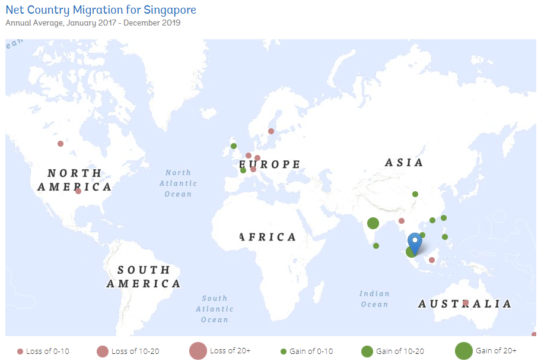
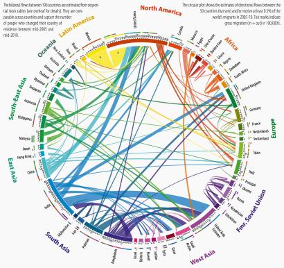
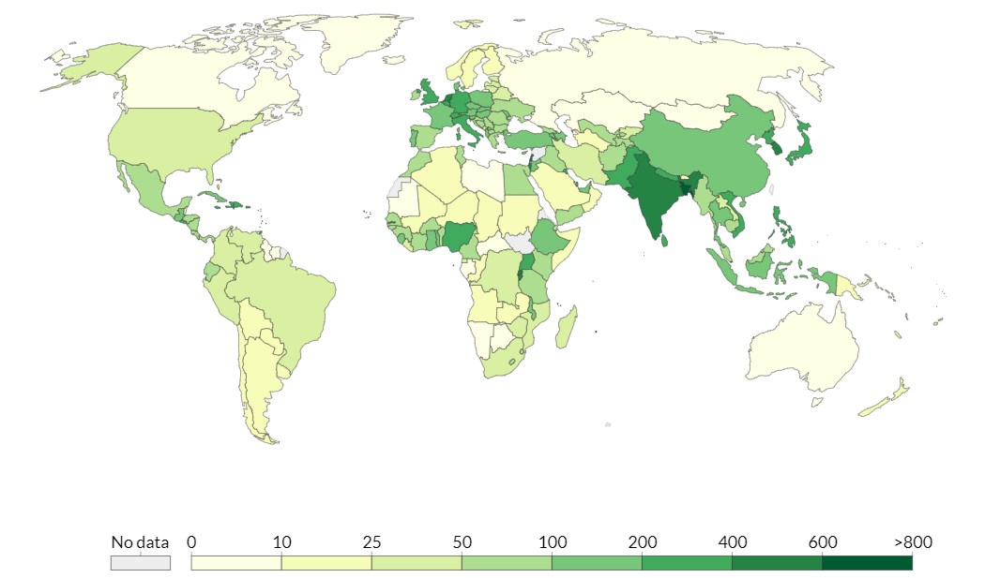

```{r setup, include=FALSE}
knitr::opts_chunk$set(echo = FALSE)
```

# 1. Introduction

This report is part of a group project for our visual analytics module. Our project is titled **VISTAS** - **V**isualising **I**ndustry **S**kill **TA**lent **S**hifts. Each group member is tasked with completing a sub-module of the final group project. A link to the proposal for our project can be found [here](https://va.moomookau.org/posts/2021-02-21-visual-analytics-project-proposal/).

Our project relies on data provided by a LinkedIn and World Bank Group partnership. The LinkedIn and World Bank Group have partnered and released data from 2015 to 2019 that focuses on 100+ countries with at least 100,000 LinkedIn members each, distributed across 148 industries and 50,000 skill categories. This data aims to help government and researchers understand rapidly evolving labor markets with detailed and dynamic data.

For my part in the project, I will be exploring various techniques for visualising talent migration in 3 aspects - Country, Skill and Industry.

The links to my group members' assignments can be found below:

1.  Cheryl Pay - Industry Skills Needs Analysis

2.  Louis Chong - [Regression and Correlation Analysis](https://affectionate-dijkstra-f71bd4.netlify.app/posts/2021-04-03-assignment/)

# 2. Literature Review

## 2.1 Official LinkedIn-World Bank visualisations

Here, we explore the existing visualisations provided at the official page of the data source. The visualisations can be found at <https://linkedindata.worldbank.org/data>.

A sample of the visualisation with Singapore as the selected country can be seen in the screenshot before.


As can be seen in the visualisation below, it provides a simple map showing the migration of talent to and from the selected country from and to the top 10 countries. The countries which the selected countries are losing to are represented by a red circle on the map, while those the selected countries are gaining from are represented by a green circle on the map. The size of the circle represents the net migration per 10k LinkedIn members of the selected country.



Hovering over a circle on the map shows a tooltip of the migration. This tooltip display the country, net migration value and the rank of the country.


Following the map, there is a table which shows the top 5 countries the selected country is gaining or losing to:


Finally, there are 2 tables which shows up to the top 5 industries and skills the selected country is gaining or losing:


## 2.2 Possible improvements for the official visualisation

The following are the proposed improvements over the official visualisation:

1.  The visualisation lacks interactivity to allow the user to perform deeper analyses. There is only a selection of country and the information is presented in the default way with no other option. The interactivity could be improved by allowing the user to select more options besides the country. For example, we could allow the user to select the date range, or let them filter by skill category or industry sections that they want to focus on. We could also allow the user to filter by region or other fields.

2.  The visualisation only shows the top 10 countries on the map, and top 5 countries, industries and skills in the table. A user may want to know more than just the top N for these metrics.

3.  The visualisation of the map and table makes it difficult to visualise the inflow vs outflow of the selected country. A visualisation which allows for comparison between inflow and outflow could be useful to know if a country is gaining or losing talent.

## 2.3 Proposed Visualisations

To visualise migration, we propose the following types of visualisations:

1.  Flow Map - A flow map shows the world map and the "flow" of migration to and from the source country. It has lines between a source and destination location. The direction of the flow can either be indicated using arrows or colours. The width of the lines can be adjusted to indicate the value of the flow. An alternative to the flow map could be the choropleth map (detailed below), or a combination of both.

    

2.  Sankey Diagram - A sankey diagram is a network diagram that represents flow between nodes. The value of the flows between nodes is usually determined by the width of the lines connecting them. As a general rule of thumb, the source node is usually on the left and the destination node is on the right. An advantage of using the sankey diagram would be that you can easily visualise the inflow and outflow of a node.

    

3.  Chord Diagram - A chord diagram shows the flows between source and destination nodes. It is aesthetically pleasing and if well presented can provide useful information on the values as well as direction of the flow. However, one downside is that it could be too cluttered if there are too many nodes represented on the diagram, leading to too many connecting lines.

    

4.  Choropleth Map - A choropleth map shows different regions shaded by various statistical properties. The lighter areas usually represent smaller values and the darker areas represent larger values. An advantage of the choropleth map is that it provides the viewer with an overview of the values at a quick glance, including providing them with geospatial context, something that may be lacking with the Sankey Diagram or Chord Diagram.

    

In terms of interactivity, we will allow the user to specify the following:

1.  The selected country they would like to visualise

2.  The year they would like to visualise

3.  The type of migration they would like to visualise i.e. country, industry or skill

4.  If they would like to filter by certain fields such as region, industry or skill category

# 3. Visualisation Prototypes

In this section, we detail how prototypes of the proposed visualisations were prepared.

## 3.1 Install and load packages

First, we install the packages that are required for our visualisations using the following code snippet. The code snippet will iteratively install (if required) and load packages from a list. The following are the packages that will be used for our visualisations:

1.  tidyverse - The tidyverse catalogue of packages will be used as our base for data cleaning, wrangling and manipulation

2.  readxl - The readxl package is used for us to read the excel files which contain our data

3.  maps, geosphere, tmap, sf, leaflet - These packages are used for geospatial manipulation and map visualisations

4.  networkD3 - The networkD3 package will be used to visualise various network diagrams, in particular the Sankey diagram

5.  chorddiag, circlize - These packages will be used to explore chord diagrams

```{r message=FALSE, warning=FALSE}
packages = c('tidyverse', 'readxl', 'maps', 'geosphere', 'tmap', 'sf', 'leaflet', 'rworldmap', 'networkD3', 'chorddiag', 'circlize')
for (p in packages){
  if(!require(p, character.only = TRUE)) {
    install.packages(p)
  }
  library(p, character.only = TRUE)
}
```

## 3.2 Load the files provided by the Linkedin-Worldbank dataset

We use the following code snippet to load the excel files, specifying the file and sheet that we want to read. The read_excel function comes from the readxl package.

```{r}
industryEmploymentGrowth <- read_excel("../data/public_use-industry-employment-growth.xlsx", sheet="Growth from Industry Transition")
industrySkillsNeeds <- read_excel("../data/public_use-industry-skills-needs.xlsx", sheet="Industry Skills Needs")
skillPenetration <- read_excel("../data/public_use-skill-penetration.xlsx", sheet="Skill Penetration")
countryMigration <- read_excel("../data/public_use-talent-migration.xlsx", sheet="Country Migration")
industryMigration <- read_excel("../data/public_use-talent-migration.xlsx", sheet="Industry Migration")
skillMigration <- read_excel("../data/public_use-talent-migration.xlsx", sheet="Skill Migration")
```

## 3.3 Exploring the migration datasets

First, we take a look at the 3 migration datasets using the following code snippets. We use the glimpse function to preview the countryMigration dataset. From the results, we can see that the data contains both the base country and the target country along with other information like the code, region, income and lat/long. For every base-target pair, there are migration values of net_per_10K for the years 2015 to 2019.

```{r}
glimpse(countryMigration)
```

Looking at the industryMigration dataset, it contains the country and industry names and the migration values for such.

```{r}
glimpse(industryMigration)
```

The skillMigration dataset is similar to the industry migration but contains the migration information of the country for the skills.

```{r}
glimpse(skillMigration)
```

## 3.4 Tidying the data files into the tidy data format

From the above, we can see that the migration values for the different years are stored in individual columns. In order to aid our analysis, it is proposed to tidy the datasets into a tidy data format. The tidy data format stipulates the following:

1.  Every column is a variable.

2.  Every row is an observation.

3.  Every cell is a single value.

The datasets above violates the part where the column headers stores a value rather than a variable. It would be better to create a new column called year to store the year values rather than having it span across 5 columns. We can achieve this by using the pivot_longer function as follows.

```{r}
countryMigrationPivot <- countryMigration %>%
  pivot_longer(col = starts_with("net_per_10K_"),
               names_to = "year",
               names_prefix = "net_per_10K_",
               values_to = "net_per_10K")

industryMigrationPivot <- industryMigration %>%
  pivot_longer(col = starts_with("net_per_10K_"),
               names_to = "year",
               names_prefix = "net_per_10K_",
               values_to = "net_per_10K")

skillMigrationPivot <- skillMigration %>%
  pivot_longer(col = starts_with("net_per_10K_"),
               names_to = "year",
               names_prefix = "net_per_10K_",
               values_to = "net_per_10K")
```

We glimpse the countryMigrationPivot dataset to see that the data from the net_per_10K columns for individual years has been pivoted to form a "year" column and "net_per_10K" column.

```{r}
glimpse(countryMigrationPivot)

```

## 3.5 Migration flow map using maps and geosphere packages

Next, we try to come up with a migration flow map using maps and geosphere package. The maps package is used to plot the map and geosphere package is used to calculate the great circle lines on the maps. We first filter the data using Singapore and 2019 to experiment. For every target country, we calculate the great circle plot the lines on the map. The width of the line is based on the ratio of the country's migration to the maximum absolute value of the migration and the colour of the line is either green or red depending on whether the net migration was positive or negative.

```{r}

singaporeMigration <- countryMigrationPivot %>%
  filter(base_country_name == "Singapore", year == 2019)

maxMigration <- max(abs(singaporeMigration$net_per_10K))

map("world", col="#191919", fill=TRUE, bg="#000000")

for (j in 1:nrow(singaporeMigration)) {
    baseLat <- singaporeMigration[j,]$base_lat
    baseLon <- singaporeMigration[j,]$base_long
    targetLat <- singaporeMigration[j,]$target_lat
    targetLon <- singaporeMigration[j,]$target_long
    migration <- gcIntermediate(c(baseLon, baseLat), c(targetLon, targetLat), n=100, addStartEnd=TRUE)
    colour = ifelse(singaporeMigration[j,]$net_per_10K >= 0, "green", "red")
    lines(migration, col=colour, lwd=abs(singaporeMigration[j,]$net_per_10K)/maxMigration*10)
}
```

From the results, we can see that the lines are plotted on the map as we wanted. However, there were a few problems with this visualisation. It was difficult to make out where the target countries were. There were also many overlapping lines. The width was also difficult to make out. Further, any lines which wrapped around the dateline resulted in horizontal lines across the width of the map.

These could be improved by having interactivity on the map to allow for more information to be shown through tooltips or by zooming in. We next explore another way to draw the migration flow on the map.

## 3.6 Migration flow map using leaflet and sf packages

In order to overcome some of the issues we faced in our previous visualisation using older packages, we attempted to use sf and leaflet to create our migration map.

```{r}
singaporeMigrationSf <- countryMigrationPivot %>%
  filter(base_country_name == "Singapore", year == 2019)

singaporeSfg <- vector(mode = "list", length = nrow(singaporeMigration))

for (j in 1:nrow(singaporeMigration)) {
  singaporeSfg[[j]] <- st_linestring(rbind(c(singaporeMigrationSf[j,]$base_long,singaporeMigrationSf[j,]$base_lat),c(singaporeMigrationSf[j,]$target_long,singaporeMigrationSf[j,]$target_lat)))
}

maxMigration = max(abs(singaporeMigrationSf$net_per_10K))

singaporeSf <- singaporeSfg %>%
  st_sfc(crs = 4326) %>%
  st_sf(geometry = .) %>%
  cbind(singaporeMigrationSf) %>%
  mutate(colour = ifelse(net_per_10K > 0, "green", "red"), value=log(abs(net_per_10K))*5) %>%
  mutate(label = lapply(paste0("Country: ",target_country_name,"<br/>Net migration: ",net_per_10K), htmltools::HTML)) %>%
  filter(value != 0)

singaporeSf %>%
  st_segmentize(units::set_units(100, km)) %>%
  mutate(geometry = (geometry + c(180,90)) %% c(360) - c(180,90)) %>%
  st_wrap_dateline(options = c("WRAPDATELINE=YES",  "DATELINEOFFSET=180"), quiet = TRUE) %>% 
  leaflet() %>%
  addTiles() %>%
  addCircleMarkers(
    lng = ~target_long,
    lat = ~target_lat,
    label = ~label,
    color = ~colour,
    radius = ~value,
    stroke = FALSE,
    fillOpacity = 0.5
  ) %>%
  addPolylines(label = ~label,
               color = ~colour,
               weight = ~value)

```

```{r}
singaporeMigrationSf <- countryMigrationPivot %>%
  filter(base_country_name == "Singapore", year == 2019)

linestrings_sfg <- vector(mode = "list", length = nrow(singaporeMigration))

for (j in 1:nrow(singaporeMigration)) {
  linestrings_sfg[[j]] <- st_linestring(rbind(c(singaporeMigrationSf[j,]$base_long,singaporeMigrationSf[j,]$base_lat),c(singaporeMigrationSf[j,]$target_long,singaporeMigrationSf[j,]$target_lat)))
}

singaporeMigrationChloropeth <- singaporeMigrationSf %>%
  select(target_country_name, net_per_10K)

singaporeMigrationChloropethMap <- joinCountryData2Map(singaporeMigrationChloropeth, joinCode = "NAME", nameJoinColumn = "target_country_name")

collection_sf <- linestrings_sfg %>%
  st_sfc(crs = 4326) %>%
  st_sf(geometry = .) %>%
  cbind(singaporeMigrationSf) %>%
  mutate(colour = ifelse(net_per_10K > 0, "green", "red"), value=abs(net_per_10K)) %>%
  mutate(label = lapply(paste(sep="<br/>",target_country_name,net_per_10K), htmltools::HTML))

maxMigration = max(abs(singaporeMigrationSf$net_per_10K))

bins <- c(-maxMigration, 0, maxMigration)
pal <- colorBin("RdBu", domain = singaporeMigrationChloropeth$net_per_10K, bins = bins)

collection_sf %>%
  st_segmentize(units::set_units(100, km)) %>%
  mutate(geometry = (geometry + c(180,90)) %% c(360) - c(180,90)) %>%
  st_wrap_dateline(options = c("WRAPDATELINE=YES",  "DATELINEOFFSET=180"), quiet = TRUE) %>% 
  leaflet() %>%
  addTiles() %>%
  addPolylines(label = ~label,
               color = ~colour,
               weight = ~value) %>%
  addPolygons(data=singaporeMigrationChloropethMap,
              fillColor = ~pal(net_per_10K),
              weight = 2,
              opacity = 1,
              color = "white",
              dashArray = "3",
              fillOpacity = 0.7)
```

# Attempting Sankey Diagram

```{r}
# Set chosen parameters
chosenCountry <- "Singapore"
chosenYear <- 2019
colourGroups <- c("region","income_group")
# Set parameter to colour group by - "region" (1) or "income_group" (2)
chosenGroup <- 2

countryDf <- countryMigrationPivot %>%
  distinct(base_country_name, base_country_wb_income, base_country_wb_region) %>%
  rename(country = base_country_name, income_group = base_country_wb_income, region = base_country_wb_region)

migrationDf <- countryMigrationPivot %>%
  filter(base_country_name == chosenCountry, year == chosenYear, net_per_10K != 0) %>%
  select(base_country_name, target_country_name, net_per_10K)

migrationSwapDf <- as.data.frame(migrationDf %>%
  mutate(source = ifelse(net_per_10K >= 0, target_country_name, base_country_name)) %>%
  mutate(target = ifelse(net_per_10K >= 0, base_country_name, target_country_name)) %>%
  mutate(value = abs(net_per_10K)*10000) %>%
  select(source, target, value))

valuesDf <- migrationDf %>%
  mutate(country = target_country_name) %>%
  mutate(value = abs(net_per_10K)) %>%
  select(country, value)

nodes <- data.frame(
  name=c(as.character(migrationSwapDf$source), 
  as.character(migrationSwapDf$target)) %>% unique()
)

nodes <- nodes %>%
  left_join(countryDf, by=c("name"="country")) %>%
  left_join(valuesDf, by=c("name"="country")) %>%
  replace_na(list(value = 0)) %>%
  arrange(desc(value))

migrationSwapDf$IDsource <- match(migrationSwapDf$source, nodes$name)-1 
migrationSwapDf$IDtarget <- match(migrationSwapDf$target, nodes$name)-1

my_color <- 'd3.scaleOrdinal(d3.schemeCategory10)'

p <- sankeyNetwork(Links = migrationSwapDf, Nodes = nodes,
              Source = "IDsource", Target = "IDtarget",
              Value = "value", NodeID = "name",
              colourScale = my_color, NodeGroup = colourGroups[chosenGroup],
              sinksRight=FALSE,
              height = 1000, width = 1000)
p
```

# Attempting Chord Diagram using chorddiag for countries

```{r}

chordDf <- countryMigrationPivot %>%
  filter(year == 2019) %>%
  select(base_country_name, target_country_name, net_per_10K) %>%
  pivot_wider(names_from=target_country_name, values_from = net_per_10K, values_fill = 0, names_sort=TRUE) %>%
  arrange(base_country_name) %>%
  column_to_rownames("base_country_name")

countryRegionDf <- countryDf %>%
  arrange(country)

countryNames <- row.names(chordDf)

chordPosDf <- chordDf
chordPosDf[chordPosDf<0] <- 0.0

chordNegDf <- chordDf
chordNegDf[chordNegDf>0] <- 0.0
chordNegDf <- abs(chordNegDf)

chordPosMatrix <- as.matrix(chordPosDf)
chordNegMatrix <- as.matrix(chordNegDf)

groupNames <- as.vector(countryRegionDf[,"region"])

p <- chorddiag(chordPosMatrix, height=1000, width=1000, groupnamePadding = 20, showTicks = FALSE, groupThickness = 0.01)
p

p <- chorddiag(chordPosMatrix, height=1000, width=1000, groupnamePadding = 20, showTicks = FALSE, groupThickness = 0.1, groupPadding=1)
p

#p <- chorddiag(chordNegMatrix, height=1000, width=1000)
#p

```

# Attepting Chord Diagram with chorddiag per region

```{r}
chordDfPos2 <- countryMigrationPivot %>%
  filter(year == 2019, net_per_10K >= 0) %>%
  group_by(base_country_wb_region, target_country_wb_region) %>%
  summarise(sum=sum(net_per_10K)) %>%
  pivot_wider(names_from=target_country_wb_region,values_from = sum, values_fill = 0.0, names_sort = TRUE) %>%
  arrange(base_country_wb_region) %>%
  column_to_rownames("base_country_wb_region")

chordMatPos2 <- as.matrix(chordDfPos2)

chorddiag(chordMatPos2)

chordDfNeg2 <- countryMigrationPivot %>%
  filter(year == 2019, net_per_10K < 0) %>%
  group_by(base_country_wb_region, target_country_wb_region) %>%
  summarise(sum=mean(net_per_10K)) %>%
  pivot_wider(names_from=target_country_wb_region,values_from = sum, values_fill = 0.0, names_sort = TRUE) %>%
  arrange(base_country_wb_region) %>%
  column_to_rownames("base_country_wb_region") %>%
  abs()

chordMatNeg2 <- as.matrix(chordDfNeg2)

chorddiag(chordMatNeg2)
```


